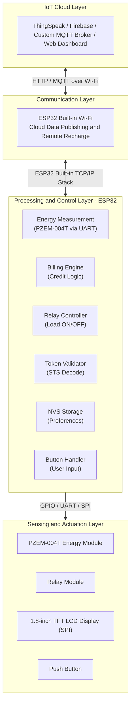
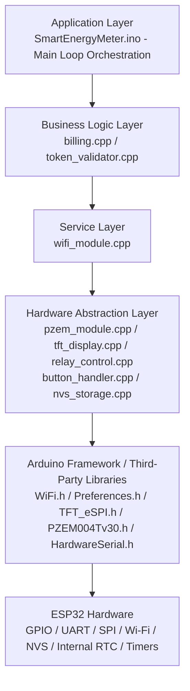
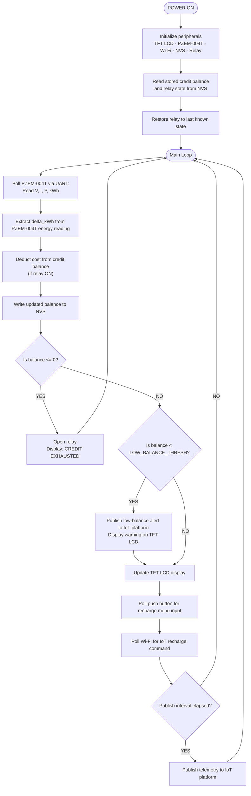

# Design and Implementation of an Advanced IoT-Based Smart Prepaid Energy Meter

**Validation Tool:** Wokwi + bench testing  
**Microcontroller Platform:** ESP32  
**Target Market:** Nigerian Electricity Distribution Sector  
**Date:** February 2026

---

## Table of Contents

1. [Project Overview](#1-project-overview)
2. [Problem Statement](#2-problem-statement)
3. [Objectives](#3-objectives)
4. [System Architecture](#4-system-architecture)
5. [Hardware Components](#5-hardware-components)
6. [Software Architecture](#6-software-architecture)
7. [Core Functional Modules](#7-core-functional-modules)
8. [IoT Integration Design](#8-iot-integration-design)
9. [Billing and Token Algorithm](#9-billing-and-token-algorithm)
10. [Wokwi Validation Design](#10-wokwi-validation-design)
11. [Firmware Build Instructions](#11-firmware-build-instructions)
12. [System Workflow](#12-system-workflow)
13. [Testing and Validation](#13-testing-and-validation)
14. [Limitations and Future Work](#14-limitations-and-future-work)
15. [References](#15-references)

---

## 1. Project Overview

This project presents the design and implementation of an advanced IoT-based smart prepaid energy meter built around the ESP32, the PZEM-004T energy measurement module, a relay-based load controller, a TFT display, and Wi-Fi connectivity for remote monitoring. The system measures energy consumption in real time, deducts prepaid credit based on the configured tariff, disconnects the load when credit is exhausted, and publishes meter status to an IoT dashboard.

The firmware is first validated in Wokwi using mocked serial inputs and GPIO interactions, then confirmed on the physical prototype using the actual hardware modules and a bench test load. This approach keeps the project implementation-oriented while still allowing early logic checks before hardware integration.

The design is aligned with the Nigerian electricity market context, where estimated billing, metering gaps, and consumer trust issues continue to create operational pressure for utilities and households.

---

## 2. Problem Statement

Conventional postpaid electricity metering systems present several challenges:

- Revenue loss from delayed billing and meter reading errors.
- High manual infrastructure cost for field reading and disconnection.
- Consumer debt accumulation and service disputes.
- Poor real-time visibility of energy usage.
- Inefficient disconnection for non-payment.
- Estimated billing practices in Nigeria that burden consumers.
- A national metering gap that increases demand for prepaid alternatives.
- Tariff complexity under the NERC MYTO Band A-E structure.

An IoT-enabled prepaid metering solution addresses these issues by shifting billing to a pay-before-use model, automating load control, and making consumption visible to both consumers and utilities.

---

## 3. Objectives

The specific objectives of this project are as follows:

1. To design a microcontroller-based circuit capable of measuring real-time voltage, current, active power, and cumulative energy consumption.
2. To implement a prepaid billing engine that deducts credit in proportion to energy consumed at a configurable tariff rate.
3. To control a relay actuator that disconnects the consumer load when credit reaches zero and reconnects it upon successful recharge.
4. To develop a token-based recharge mechanism compliant with Standard Transfer Specification principles, deliverable via push button entry or an IoT dashboard.
5. To leverage the ESP32 built-in Wi-Fi module for real-time data publishing to an IoT platform and remote recharge command reception.
6. To persist meter state in ESP32 Non-Volatile Storage, ensuring data retention across power cycles.
7. To validate the firmware logic in Wokwi and confirm full behaviour on the physical prototype before final deployment.

---

## 4. System Architecture

The system is structured into four interconnected layers:



### Data Flow Summary

1. The PZEM-004T measures AC voltage, current, active power, frequency, power factor, and cumulative energy.
2. The firmware reads these values at a configurable interval and feeds them into the billing engine.
3. The billing engine converts energy use into monetary deduction and updates the stored balance in NVS.
4. When credit reaches zero, the relay controller disconnects the load.
5. A user can enter a recharge token through the push button menu or through the IoT dashboard.
6. The token validator checks the token, credits the balance, and restores the relay if needed.
7. Meter status is shown on the TFT display and published to the IoT cloud.

---

## 5. Hardware Components

The following components constitute the physical hardware of the system.

### 5.1 Microcontroller

| Component | Model | Justification |
|---|---|---|
| Microcontroller | ESP32 | Dual-core 32-bit processor, built-in Wi-Fi, multiple UART/SPI/I2C peripherals, Arduino IDE compatible |

### 5.2 Sensing Components

| Component | Model | Role |
|---|---|---|
| Energy Measurement Module | PZEM-004T | Dedicated AC energy meter module; measures voltage, current, power, energy, frequency, and power factor; communicates via UART/Modbus |

> Note: The PZEM-004T handles AC signal conditioning and measurement internally, so the firmware does not need discrete current sensors or RMS computation.

### 5.3 Display and Input

| Component | Model | Role |
|---|---|---|
| LCD Display | 1.8-inch TFT LCD (ST7735/ILI9163 driver) | Displays voltage, current, power, balance, and alerts via SPI |
| Input | Push Button | Used for recharge menu navigation and token confirmation |

### 5.4 Communication Modules

| Component | Model | Interface | Role |
|---|---|---|---|
| Wi-Fi Module | ESP32 Built-in Wi-Fi (802.11 b/g/n) | Native TCP/IP stack | Publishes data and receives remote recharge commands |

### 5.5 Power Control

| Component | Model | Role |
|---|---|---|
| Relay Module | 5V Single-Channel Relay | Disconnects the load when credit is exhausted |
| Flyback Diode | 1N4007 | Protects the MCU GPIO from relay coil back-EMF |

### 5.6 Data Persistence and Timekeeping

| Component | Model | Interface | Role |
|---|---|---|---|
| NVS Storage | ESP32 Non-Volatile Storage (Preferences library) | Internal SPI flash | Stores balance, cumulative kWh, relay state, and used token records |
| RTC | ESP32 Internal RTC (NTP-synced) | Built-in | Provides timestamps for logs and telemetry |

### 5.7 Power Supply

| Component | Specification |
|---|---|
| DC Power Supply | 5V regulated supply for MCU and peripherals |
| AC Load Supply | 230V AC sinusoidal source for bench testing |

---

## 6. Software Architecture

The firmware is written in embedded C++ using the Arduino framework and follows a modular design.



### Design Principles Applied

- Separation of concerns.
- Single responsibility for each module.
- Non-blocking execution using `millis()`-based scheduling.
- Defensive NVS reads with default-value fallback.

---

## 7. Core Functional Modules

### 7.1 Energy Measurement Module (`pzem_module`)

This module communicates with the PZEM-004T via UART/Modbus and returns voltage, current, power, energy, frequency, and power factor.

### 7.2 Billing Engine (`billing`)

The billing engine converts energy consumption to a monetary cost and manages the prepaid credit balance. It supports a configurable tariff rate and a low-balance alert threshold.

### 7.3 Token Validator (`token_validator`)

The recharge token system follows a simplified STS-style model. Tokens are 20-digit numeric codes bound to a meter ID and a credit value. The token validator checks the meter ID, validates the checksum, and rejects reused tokens.

### 7.4 Relay Control Module (`relay_control`)

Manages the state of the relay that controls load connectivity. Relay state is stored in NVS for correct restoration after a power cycle.

### 7.5 TFT Display Module (`tft_display`)

Abstracts the 1.8-inch TFT LCD into application-level rendering functions for home, warning, recharge, and status screens.

### 7.6 Push Button Handler (`button_handler`)

Manages button input with software debouncing and distinguishes between short press and long press events.

### 7.7 Wi-Fi Module (`wifi_module`)

Uses the ESP32 built-in Wi-Fi and HTTP client stack to publish telemetry and poll for remote recharge commands.

### 7.8 NVS Storage (`nvs_storage`)

Provides persistent key-value storage across power cycles using the ESP32 Preferences library.

---

## 8. IoT Integration Design

The IoT layer follows a publish-subscribe pattern for telemetry and a request-response pattern for remote recharge commands.

### Published Data Fields

| Field | Type | Unit | Description |
|---|---|---|---|
| `voltage` | float | V | RMS line voltage |
| `current` | float | A | RMS load current |
| `power` | float | W | Active power |
| `energy_kwh` | float | kWh | Cumulative energy |
| `credit_balance` | float | Currency | Remaining balance |
| `relay_state` | int | - | 1 = connected, 0 = disconnected |
| `timestamp` | string | ISO 8601 | NTP-sourced time |

### Remote Recharge via IoT Dashboard

1. A utility operator generates a recharge token from the dashboard.
2. The token is pushed to the IoT platform as a command payload.
3. The ESP32 polls the platform and retrieves the pending command.
4. The token string is forwarded to the token validator.
5. If valid, the balance is credited and the relay is re-enabled.

---

## 9. Billing and Token Algorithm

### 9.1 Credit Deduction Loop

The billing deduction runs every `BILLING_INTERVAL_MS` milliseconds, defaulting to 1000 ms.

```
energy_increment (Wh)  = P_active (W) x (BILLING_INTERVAL_MS / 3,600,000)
energy_increment (kWh) = energy_increment (Wh) / 1000
cost_increment         = energy_increment (kWh) x TARIFF_RATE (₦/kWh)
credit_balance         = credit_balance - cost_increment
```

### 9.2 Token Structure (Simplified STS Model)

```
[4-digit Meter ID Prefix] [12-digit Encoded Value] [4-digit Checksum]
```

Example: `1234 560000150000 7891`

---

## 10. Wokwi Validation Design

### 10.1 Overview

Wokwi is used to validate the ESP32 firmware logic, mock serial input handling, button interactions, relay logic, and display updates before the hardware prototype is exercised on the bench.

### 10.2 Validation Setup

1. Create an ESP32 project in Wokwi.
2. Load the firmware sketch and module logic.
3. Connect mocked UART input for PZEM frames.
4. Verify TFT display updates and relay output behaviour.
5. Check Wi-Fi request formatting in the serial monitor.
6. Test recharge, low-balance, and zero-credit paths.
7. Transfer the validated firmware to the physical prototype for final confirmation.

### 10.3 Validation Constraints

- Wokwi validates firmware logic, not AC mains physics.
- The PZEM-004T hardware behavior is mocked during validation.
- Final load-side confirmation is completed on the physical prototype.

---

## 11. Firmware Build Instructions

### 11.1 Required Libraries

Install the following libraries via the Arduino IDE Library Manager:

| Library Name | Version | Purpose |
|---|---|---|
| `TFT_eSPI` | >= 2.5.0 | TFT LCD via SPI |
| `PZEM-004T-v30` | >= 1.1.2 | PZEM-004T energy module communication |
| `WiFi` | Built-in | ESP32 Wi-Fi stack |
| `HTTPClient` | Built-in | HTTP GET/POST |
| `Preferences` | Built-in | ESP32 NVS key-value storage |
| `HardwareSerial` | Built-in | UART communication |

### 11.2 Configuration Constants

Configure the following constants in `SmartEnergyMeter.ino` before compilation:

```cpp
#define METER_ID            1234
#define TARIFF_RATE         68.00f
#define INITIAL_BALANCE     2000.00f
#define LOW_BALANCE_THRESH  500.00f
#define BILLING_INTERVAL_MS 1000
#define PZEM_RX_PIN         16
#define PZEM_TX_PIN         17
#define RELAY_PIN           4
#define BUTTON_PIN          0
#define WIFI_SSID           "YourSSID"
#define WIFI_PASSWORD       "YourPassword"
#define IOT_SERVER          "api.thingspeak.com"
#define IOT_API_KEY         "YOUR_API_KEY"
```

---

## 12. System Workflow



---

## 13. Testing and Validation

Testing is carried out through Wokwi-based firmware validation and physical bench testing.

| Test ID | Scenario | Expected Outcome | Validation Method |
|---|---|---|---|
| TC-01 | Power-on with stored credit balance | TFT LCD displays correct balance from NVS on startup | Visual inspection of TFT LCD |
| TC-02 | PZEM-004T providing energy readings via UART | V, I, P, and kWh values read and displayed correctly | Compare mocked UART output against displayed TFT values |
| TC-03 | Credit balance decrements over time | Balance decreases at the expected rate | Monitor balance over time |
| TC-04 | Valid token entered via push button menu | Balance increases and relay closes if previously open | Visual inspection |
| TC-05 | Invalid token entered | TFT LCD displays token error; balance unchanged | Visual inspection |
| TC-06 | Already-used token re-entered | TFT LCD displays used-token error; balance unchanged | NVS token log verification |
| TC-07 | Balance reaches zero | Relay opens; TFT LCD displays credit exhausted; load extinguishes | Relay state indicator |
| TC-08 | Low-balance threshold crossed | IoT output shows a low-balance publish event | Serial / dashboard output |
| TC-09 | Power cycle during active session | Balance and relay state restore correctly from NVS | Power-cycle restart test |
| TC-10 | IoT telemetry publish interval | HTTP request string appears at the correct interval | Serial monitor inspection |

---

## 14. Limitations and Future Work

### 14.1 Current Limitations

- Wokwi validates logic but not AC mains physics.
- The full STS cryptographic token generation algorithm is not implemented.
- Final Wi-Fi and IoT behavior must be confirmed on the real ESP32 hardware.
- Tamper detection features are outside the current prototype scope.

### 14.2 Recommended Future Enhancements

1. Implement full STS IEC 62055-41 token cryptography.
2. Replace HTTP polling with MQTT for lower latency.
3. Add OTA firmware updates.
4. Replace the push button with a capacitive touch display.
5. Design a tamper-evident enclosure for field deployment.

---

## 15. References

1. International Electrotechnical Commission. (2014). *IEC 62055-41: Electricity Metering — Payment Systems — Standard Transfer Specification (STS) — Part 41: Application Layer Protocol for One-Way Token Carrier Systems.* IEC.
2. Espressif Systems. (2023). *ESP32 Technical Reference Manual* (Version 5.0). Espressif Systems.
3. PEACEFAIR. (2022). *PZEM-004T Power Energy Meter Module: User Manual and Communication Protocol.* PEACEFAIR Electronic.
4. Amin, M., & Wollenberg, B. F. (2005). Toward a smart grid: Power delivery for the 21st century. *IEEE Power and Energy Magazine*, 3(5), 34-41.
5. Depuru, S. S. S. R., Wang, L., & Devabhaktuni, V. (2011). Smart meters for power grid: Challenges, issues, advantages and status. *Renewable and Sustainable Energy Reviews*, 15(6), 2736-2742.
6. Nigerian Electricity Regulatory Commission (NERC). (2022). *Multi-Year Tariff Order (MYTO) 2.1 - Minimum Remittable Tariff and Band Classification.* NERC, Abuja, Nigeria.
7. Federal Ministry of Power, Nigeria. (2021). *National Mass Metering Programme (NMMP) - Phase 0 Report.* Federal Government of Nigeria.
8. Iwayemi, A. (2008). Nigeria's Dual Energy Problems: Policy Issues and Challenges. *International Association for Energy Economics Newsletter*, 17(4), 17-21.
