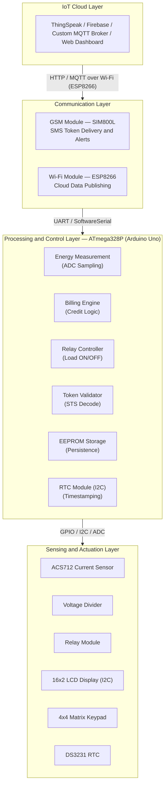
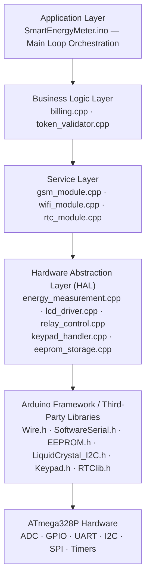
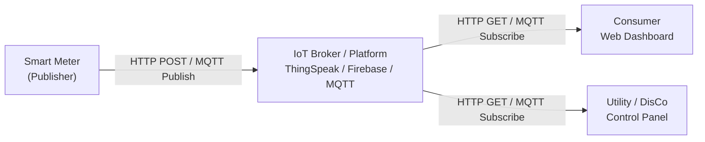
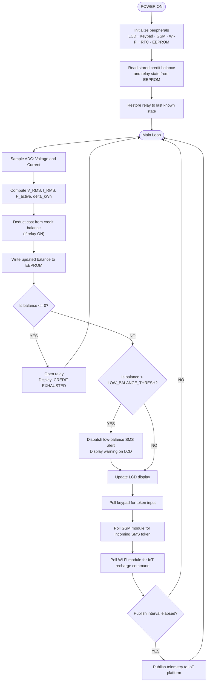

# Design and Implementation of an Advanced IoT-Based Smart Prepaid Energy Meter
 
**Simulation Tool:** Proteus Design Suite 8  
**Microcontroller Platform:** Arduino Uno (ATmega328P)  
**Target Market:** Nigerian Electricity Distribution Sector  
**Date:** February 2026  
**Repository:** [https://github.com/thetruesammyjay/Iot-Based-Smart-Prepaid-Energy-Meter-Proteus](https://github.com/thetruesammyjay/Iot-Based-Smart-Prepaid-Energy-Meter-Proteus)  

---

## Table of Contents

1. [Project Overview](#1-project-overview)
2. [Problem Statement](#2-problem-statement)
3. [Objectives](#3-objectives)
4. [System Architecture](#4-system-architecture)
5. [Hardware Components](#5-hardware-components)
6. [Software Architecture](#6-software-architecture)
7. [Core Functional Modules](#7-core-functional-modules)
8. [IoT Integration Design](#8-iot-integration-design)
9. [Billing and Token Algorithm](#9-billing-and-token-algorithm)
10. [Proteus Simulation Design](#10-proteus-simulation-design)
11. [Running the Simulation](#11-running-the-simulation)
12. [Firmware Build Instructions](#12-firmware-build-instructions)
13. [System Workflow](#13-system-workflow)
14. [Testing and Validation](#14-testing-and-validation)
15. [Limitations and Future Work](#15-limitations-and-future-work)
16. [References](#16-references)

---

## 1. Project Overview

This project presents the design and implementation of an Advanced IoT-Based Smart Prepaid Energy Meter, developed as a simulation-driven prototype using Proteus Design Suite 8. The system addresses the operational and financial inefficiencies inherent in traditional postpaid electricity metering by integrating embedded systems design, real-time energy measurement, prepaid billing logic, and IoT-based remote communication into a unified solution.

The meter measures electrical energy consumed by a load in real time, deducts from a preloaded credit balance, and disconnects the load automatically upon credit exhaustion. Consumers can recharge the meter remotely via SMS token delivery or an IoT web dashboard. Utility providers gain access to centralized consumption data without requiring physical meter reading.

The entire system — from the microcontroller firmware to the hardware peripherals — is modelled and validated within a Proteus virtual environment, enabling full functional testing prior to physical prototyping.

This project is designed with the Nigerian electricity market in mind, where a documented metering gap, widespread estimated billing practices by Distribution Companies (DisCos), and infrastructure constraints under the Nigerian Electricity Regulatory Commission (NERC) framework present unique deployment challenges that a smart prepaid metering solution is positioned to address.

---

## 2. Problem Statement

Conventional postpaid electricity metering systems present several well-documented challenges:

- **Revenue Loss:** Delayed billing cycles and meter reading inaccuracies result in significant revenue leakage for utility companies.
- **Manual Infrastructure Costs:** Physical meter reading requires large field workforces and introduces human error.
- **Consumer Debt Accumulation:** Postpaid consumers often accumulate unpayable debts, leading to service disconnection disputes.
- **Lack of Consumption Transparency:** Consumers have no real-time visibility into their energy usage, making proactive conservation difficult.
- **Disconnection Inefficiency:** Remote load disconnection for non-payment is not feasible in traditional analog metering systems.
- **Estimated Billing (Nigeria-Specific):** Nigerian DisCos have historically issued estimated bills to unmetered consumers, resulting in arbitrary and often inflated invoices that impose financial hardship on households and businesses.
- **National Metering Gap:** NERC has documented a metering gap in which millions of electricity consumers lack functional meters. The federal government's National Mass Metering Programme (NMMP) was launched specifically to address this deficit, creating a policy-driven demand for smart prepaid meter deployment.
- **NERC Band-Based Tariff Complexity:** Nigeria's Multi-Year Tariff Order (MYTO) introduces a Band A–E pricing structure tied to daily hours of electricity supply. A compliant metering solution must support a configurable, band-aware tariff engine to accurately reflect consumer-specific billing rates.

An IoT-enabled prepaid metering solution directly resolves these challenges by shifting billing to a pay-before-use model, automating load control, and enabling bidirectional communication between consumer devices and utility infrastructure.

---

## 3. Objectives

The specific objectives of this project are as follows:

1. To design a microcontroller-based circuit capable of measuring real-time voltage, current, active power, and cumulative energy consumption (kWh).
2. To implement a prepaid billing engine that deducts credit in proportion to energy consumed at a configurable tariff rate.
3. To control a relay actuator that automatically disconnects the consumer load when credit reaches zero and reconnects it upon successful recharge.
4. To develop a token-based recharge mechanism compliant with Standard Transfer Specification (STS) principles, deliverable via SMS or IoT dashboard.
5. To integrate a GSM module (SIM800L) for SMS-based token delivery and a Wi-Fi module (ESP8266) for real-time data publishing to an IoT platform.
6. To persist meter state (credit balance, cumulative consumption) in non-volatile EEPROM storage, ensuring data retention across power cycles.
7. To simulate the complete hardware and firmware stack using Proteus Design Suite 8 to validate system behaviour before physical implementation.

---

## 4. System Architecture

The system is structured into four interconnected layers:



### Data Flow Summary

1. The ACS712 current sensor and resistive voltage divider feed analog signals to the ATmega328P ADC inputs.
2. The firmware computes instantaneous power and integrates it over time to yield energy in kWh.
3. The billing engine converts kWh to monetary cost and decrements the stored credit balance.
4. When credit reaches zero, the relay control module opens the relay, disconnecting the load.
5. A consumer enters a recharge token via the 4x4 keypad. The token validator verifies the token and credits the balance.
6. Alternatively, a token is received by the GSM module via SMS or pushed by the IoT dashboard over Wi-Fi.
7. All operational data — voltage, current, power, balance — is displayed on the 16x2 LCD and published to the IoT cloud.

---

## 5. Hardware Components

The following components constitute the physical (and simulated) hardware of the system. Each component is available in the Proteus component library or can be imported via a third-party Proteus model.

### 5.1 Microcontroller

| Component | Model | Justification |
|---|---|---|
| Microcontroller | ATmega328P (Arduino Uno) | Widely supported, sufficient ADC channels, I2C/UART support, Arduino IDE compatibility |

### 5.2 Sensing Components

| Component | Model | Role |
|---|---|---|
| Current Sensor | ACS712-30A | Hall-effect current measurement; outputs analog voltage proportional to current |
| Voltage Sensor | Resistive Voltage Divider (R1=30kΩ, R2=7.5kΩ) | Scales 230V AC mains voltage down to 0–5V ADC-compatible range |

> Note: In the Proteus simulation, the ACS712 is modelled using a voltage-controlled voltage source (VCVS) with a sensitivity of 66 mV/A. The AC mains supply is simulated using a sinusoidal voltage generator.

### 5.3 Display and Input

| Component | Model | Role |
|---|---|---|
| LCD Display | 16x2 LCD with PCF8574 I2C expander | Real-time display of voltage, current, power, balance, and alerts |
| Keypad | 4x4 Matrix Keypad | Token entry, PIN input, menu navigation |

### 5.4 Communication Modules

| Component | Model | Interface | Role |
|---|---|---|---|
| GSM Module | SIM800L | UART (SoftwareSerial) | SMS token reception and low-balance alert transmission |
| Wi-Fi Module | ESP8266 (ESP-01) | UART (SoftwareSerial) | IoT dashboard data publishing via HTTP/MQTT |

> Note: In Proteus simulation, GSM and Wi-Fi modules are modelled as virtual UART terminals. A Virtual Terminal component is connected to the ATmega328P software serial pins to simulate AT command exchanges.

### 5.5 Power Control

| Component | Model | Role |
|---|---|---|
| Relay Module | 5V Single-Channel Relay | Electromechanical load disconnection upon zero credit |
| Flyback Diode | 1N4007 | Protects the MCU GPIO from relay coil back-EMF |

### 5.6 Data Persistence and Timekeeping

| Component | Model | Interface | Role |
|---|---|---|---|
| RTC Module | DS3231 | I2C | Accurate timestamping for consumption logs and time-of-use tariffs |
| EEPROM | AT24C256 (External) | I2C | Persistent storage of credit balance and cumulative kWh consumption |

> The ATmega328P also contains 1KB of internal EEPROM; the external AT24C256 provides 256KB for extended logging capacity.

### 5.7 Power Supply

| Component | Specification |
|---|---|
| DC Power Supply | 5V regulated supply for MCU and peripherals |
| AC Load Supply | 230V AC sinusoidal source (simulated in Proteus) |

---

## 6. Software Architecture

The firmware is written in embedded C++ using the Arduino framework and follows a modular, single-responsibility design. The software is organized into the following architectural layers:



### Design Principles Applied

- **Separation of Concerns:** Each peripheral is encapsulated in its own module with a defined header interface, preventing tight coupling between subsystems.
- **Single Responsibility Principle:** Each `.cpp` file is responsible for exactly one system concern.
- **Non-Blocking Execution:** The main loop uses time-based scheduling (via `millis()`) rather than `delay()` to ensure concurrent operation of display refresh, ADC sampling, and communication polling.
- **Defensive Programming:** All EEPROM read operations validate stored data against known sentinel values to detect first-boot or corrupted state conditions.

---

## 7. Core Functional Modules

### 7.1 Energy Measurement Module (`energy_measurement`)

This module performs real-time sampling of the AC voltage and current waveforms using the ATmega328P ADC (10-bit, 5V reference).

**Voltage Measurement:**
The AC mains voltage is stepped down through a resistive voltage divider and fed into an analog input pin. The ADC samples the waveform, and the Root Mean Square (RMS) voltage is calculated over a full waveform cycle using:

$$V_{RMS} = \sqrt{\frac{1}{N} \sum_{i=1}^{N} v_i^2}$$

where $v_i$ are the instantaneous sampled voltage values and $N$ is the number of samples per cycle.

**Current Measurement:**
The ACS712-30A sensor outputs a DC-biased analog voltage (2.5V at zero current, ±0.066V per ampere for the 30A variant). The firmware subtracts the DC offset and computes the RMS current:

$$I_{RMS} = \sqrt{\frac{1}{N} \sum_{i=1}^{N} i_i^2}$$

**Power and Energy:**
Active (real) power is calculated assuming a resistive load:

$$P_{active} = V_{RMS} \times I_{RMS}$$

Cumulative energy in kilowatt-hours:

$$E = \int_{0}^{T} P \, dt \approx \sum_{k} P_k \cdot \Delta t_k \times \frac{1}{3{,}600{,}000}$$

where $\Delta t_k$ is the sampling interval in milliseconds.

### 7.2 Billing Engine (`billing`)

The billing engine converts energy consumption to a monetary cost and manages the prepaid credit balance.

- **Tariff Rate:** Configurable cost per kWh in Nigerian Naira (e.g., ₦68.00/kWh for NERC Band B residential), stored in firmware constants and adjustable via EEPROM. The system supports the NERC Multi-Year Tariff Order (MYTO) Band A–E structure by allowing the tariff rate to be updated remotely via the IoT dashboard.
- **Credit Deduction:** At each billing interval (configurable, default: every 1 second), the incremental energy consumed is costed and deducted from the stored balance.
- **Low-Balance Alert:** When the balance falls below a configurable threshold (e.g., ₦500.00), an alert is displayed on the LCD and an SMS is dispatched via the GSM module to the registered consumer phone number.
- **Zero-Credit Cutoff:** When the balance reaches ₦0.00, the relay control module is invoked to disconnect the load.

### 7.3 Token Validator (`token_validator`)

The recharge token system is modelled on Standard Transfer Specification (STS) IEC 62055-41 principles.

- Tokens are 20-digit numeric codes generated by a utility authority and cryptographically bound to a specific meter serial number and credit value.
- On token entry, the validator decodes the token, verifies the meter ID match, checks the one-time-use flag in EEPROM, and credits the decoded value to the balance.
- Invalid or already-used tokens are rejected with an error message on the LCD.

> In the simulation context, tokens are pre-generated strings verified against a lookup table stored in program memory (PROGMEM), since full STS cryptographic implementation (DKGA04 algorithm) is beyond the scope of the Proteus simulation.

### 7.4 Relay Control Module (`relay_control`)

Manages the state of the relay that controls load connectivity:

- `relay_on()` — energizes the relay coil, closing the circuit and enabling the load.
- `relay_off()` — de-energizes the relay coil, opening the circuit and disconnecting the load.
- Relay state is stored in EEPROM to recover correctly after a power cycle.

### 7.5 LCD Driver (`lcd_driver`)

Abstracts the 16x2 I2C LCD display into application-level rendering functions:

- **Home Screen:** Displays real-time voltage (V), current (A), power (W), and remaining credit.
- **Alert Screen:** Displays low-balance warning and estimated time remaining.
- **Recharge Screen:** Prompts for token entry and confirms successful recharge.
- **History Screen:** Displays the last recorded kWh reading and timestamp from the RTC.

### 7.6 Keypad Handler (`keypad_handler`)

Manages the 4x4 matrix keypad with software debouncing:

- Collects 20-digit numeric token input character by character.
- Supports a dedicated `#` confirm key and `*` cancel/clear key.
- Enforces a configurable lockout period after three consecutive failed token entries as a tamper deterrent.

### 7.7 GSM Module (`gsm_module`)

Communicates with the SIM800L via AT commands over a software serial interface:

- **Outbound:** Sends low-balance SMS alerts and power cutoff notifications to the registered consumer phone number.
- **Inbound:** Polls for incoming SMS messages, extracts and forwards 20-digit token strings to the token validator module.
- Key AT commands used: `AT+CMGF=1` (text mode), `AT+CMGS` (send SMS), `AT+CMGL="UNREAD"` (read incoming messages).

### 7.8 Wi-Fi Module (`wifi_module`)

Communicates with the ESP8266 (ESP-01) via AT commands over a second software serial interface:

- Connects to a configured Wi-Fi SSID at startup.
- Publishes energy readings and credit balance to an IoT platform (e.g., ThingSpeak) via HTTP GET requests at a configurable interval.
- Receives recharge commands from the IoT dashboard web interface via HTTP polling or MQTT subscription.

### 7.9 EEPROM Storage (`eeprom_storage`)

Provides persistent key-value storage across power cycles:

| Key | Data | Size |
|---|---|---|
| `CREDIT_BALANCE` | Current monetary balance (float) | 4 bytes |
| `CUMULATIVE_KWH` | Total lifetime energy consumption (float) | 4 bytes |
| `RELAY_STATE` | Last relay state (byte: 0 or 1) | 1 byte |
| `METER_ID` | Unique meter serial number (uint32_t) | 4 bytes |
| `TOKEN_LOG` | Circular buffer of last 10 used token hashes | 80 bytes |
| `TARIFF_RATE` | Cost per kWh (float) | 4 bytes |

### 7.10 RTC Module (`rtc_module`)

Interfaces with the DS3231 via I2C to:

- Stamp each EEPROM consumption log entry with the current date and time.
- Support time-of-use (TOU) tariff logic, enabling peak and off-peak pricing based on the time of day.
- Provide accurate elapsed-time calculation for the energy integration loop.

---

## 8. IoT Integration Design

### 8.1 Architecture Pattern

The IoT layer follows a **Publish-Subscribe** pattern for telemetry and a **Request-Response** pattern for remote recharge commands.



### 8.2 Published Data Fields

The following data fields are transmitted to the IoT platform at each publish interval (default: every 15 seconds):

| Field | Type | Unit | Description |
|---|---|---|---|
| `voltage` | float | V | RMS line voltage |
| `current` | float | A | RMS load current |
| `power` | float | W | Active power |
| `energy_kwh` | float | kWh | Cumulative energy |
| `credit_balance` | float | Currency | Remaining balance |
| `relay_state` | int | — | 1 = connected, 0 = disconnected |
| `timestamp` | string | ISO 8601 | RTC-sourced timestamp |

### 8.3 Remote Recharge via IoT Dashboard

1. A utility operator generates a recharge token from the dashboard.
2. The token is pushed to the IoT platform as a command payload.
3. The ESP8266 module polls the platform and retrieves the pending command.
4. The token string is forwarded to the token validator module over the internal serial bus.
5. Upon successful validation, the balance is credited and the relay is engaged if previously disconnected.

---

## 9. Billing and Token Algorithm

### 9.1 Credit Deduction Loop

The billing deduction executes every `BILLING_INTERVAL_MS` milliseconds (default: 1000ms) within the main firmware loop:

```
energy_increment (Wh)  = P_active (W) x (BILLING_INTERVAL_MS / 3,600,000)
energy_increment (kWh) = energy_increment (Wh) / 1000
cost_increment         = energy_increment (kWh) x TARIFF_RATE (₦/kWh)
credit_balance         = credit_balance - cost_increment
```

The updated balance is written to EEPROM immediately after each deduction to ensure consistency in the event of a power failure.

### 9.2 Token Structure (Simplified STS Model)

For this simulation, tokens are structured as follows:

```
[4-digit Meter ID Prefix] [12-digit Encoded Value] [4-digit Checksum]
```

Example: `1234 560000150000 7891`

- **Meter ID Prefix:** Must match the meter's stored ID; prevents tokens intended for other meters from being used.
- **Encoded Value:** Encodes the credit amount and token class (standard top-up, maintenance, test).
- **Checksum:** A 4-digit CRC computed over the first 16 digits; used to detect manually forged tokens.

---

## 10. Proteus Simulation Design

### 10.1 Overview

The Proteus simulation replicates the entire hardware system in a virtual environment. All signal interactions — ADC sampling, I2C communication, UART exchanges, relay switching, and LCD rendering — are fully functional within the simulation. No physical hardware is required to validate the system.

### 10.2 Simulated Components and Their Proteus Equivalents

| Physical Component | Proteus Component / Model | Library |
|---|---|---|
| Arduino Uno (ATmega328P) | `ARDUINO UNO R3` | Arduino library (built-in) |
| ACS712 Current Sensor | `VCVS` (Voltage-Controlled Voltage Source) | ANALOGUE |
| Voltage Divider | Resistors R1, R2 with sine wave generator | DEVICE |
| 16x2 I2C LCD | `LM016L` with PCF8574 I2C expander model | Display |
| 4x4 Matrix Keypad | `KEYPAD-SMALLCALC` | ACTIVE |
| SIM800L GSM Module | `VIRTUAL TERMINAL` (UART terminal) | Virtual Instruments |
| ESP8266 Wi-Fi Module | `VIRTUAL TERMINAL` (UART terminal) | Virtual Instruments |
| DS3231 RTC | `DS1307` (functionally equivalent model) | ACTIVE |
| AT24C256 EEPROM | `24C02` (scaled for simulation scope) | ACTIVE |
| 5V Relay Module | `RELAY` (generic coil-driven relay) | ACTIVE |
| AC Load | Lamp or resistive load model | ACTIVE |
| 230V AC Source | `VSINE` (AC voltage generator) | Generators |

### 10.3 Simulation Constraints and Approximations

The following approximations are made in the Proteus environment due to simulation limitations:

1. **GSM / Wi-Fi Simulation:** Physical RF communication cannot be simulated in Proteus. The SIM800L and ESP8266 are replaced by Virtual Terminal components. AT command responses are pre-scripted using Proteus scripting or manually entered to simulate module responses during demonstration.

2. **ACS712 Model:** The ACS712 does not exist natively in the Proteus library. It is modelled as a voltage-controlled voltage source (VCVS) with an appropriate gain to replicate the 66 mV/A sensitivity of the 30A variant.

3. **ADC Noise:** Real ADC noise and quantization effects present in physical hardware are absent from the ideal simulation environment. Firmware filtering algorithms (moving average) may appear more accurate in simulation than in practice.

4. **RTC Oscillator:** The DS1307 model in Proteus simulates timekeeping at simulation speed, not real-world speed. Time-dependent tests (e.g., TOU tariffs) must account for this by manually advancing the RTC register values.

5. **EEPROM Wear:** Proteus does not simulate EEPROM write endurance. In physical deployment, write-minimization strategies are essential to remain within the AT24C256's 1,000,000 write cycle limit.

### 10.4 Proteus Circuit Connections Summary

#### ATmega328P Pin Assignments

| Pin | Function | Connected To |
|---|---|---|
| A0 | ADC — Voltage Sensor | Voltage divider output |
| A1 | ADC — Current Sensor | ACS712 output |
| D2 | Digital Input — Keypad Row 1 | Keypad matrix |
| D3 | Digital Input — Keypad Row 2 | Keypad matrix |
| D4 | Digital Input — Keypad Row 3 | Keypad matrix |
| D5 | Digital Input — Keypad Row 4 | Keypad matrix |
| D6 | Digital Output — Keypad Col 1 | Keypad matrix |
| D7 | Digital Output — Keypad Col 2 | Keypad matrix |
| D8 | Digital Output — Keypad Col 3 | Keypad matrix |
| D9 | Digital Output — Keypad Col 4 | Keypad matrix |
| D10 | Digital Output — Relay Control | Relay module IN pin |
| D11 (TX) | SoftwareSerial TX — GSM | SIM800L RX |
| D12 (RX) | SoftwareSerial RX — GSM | SIM800L TX |
| D13 (TX) | SoftwareSerial TX — Wi-Fi | ESP8266 RX |
| A2 (RX) | SoftwareSerial RX — Wi-Fi | ESP8266 TX |
| SDA (A4) | I2C Data | LCD, RTC, EEPROM (shared bus) |
| SCL (A5) | I2C Clock | LCD, RTC, EEPROM (shared bus) |

---

## 11. Running the Simulation

### 11.1 Prerequisites

- **Proteus Design Suite 8.x** (version 8.9 or later recommended)
- **Arduino IDE 1.8.x or 2.x** (required only if recompiling the firmware)
- Third-party Proteus models (if not built-in): Arduino Uno library for Proteus (import via Library Manager or manual `.LIB` file placement)

### 11.2 Step-by-Step Simulation Procedure

**Step 1 — Open the Project**
1. Launch Proteus Design Suite 8.
2. Navigate to `File > Open Project` and select `proteus/SmartEnergyMeter.pdsprj`.
3. The schematic will load with all components placed and wired.

**Step 2 — Verify the HEX File Assignment**
1. Double-click the Arduino Uno component in the schematic to open its properties.
2. In the `Program File` field, ensure the path points to `proteus/SmartEnergyMeter.hex`.
3. Set the `Clock Frequency` to `16MHz` to match the Arduino Uno hardware specification.
4. Click `OK` to confirm.

**Step 3 — Configure the Virtual Terminals (GSM and Wi-Fi)**
1. Double-click each Virtual Terminal component and set `Baud Rate` to `9600`, `Data Bits` to `8`, `Parity` to `None`, `Stop Bits` to `1`.
2. These terminals will display AT command traffic during simulation for GSM and Wi-Fi communication observation.

**Step 4 — Run the Simulation**
1. Click the `Play` button (green triangle) in the Proteus toolbar or press `F12`.
2. The simulation will initialize. The LCD should display the meter home screen after approximately 2 simulation seconds.
3. Observe the displayed voltage, current, power, and credit balance values cycling on the LCD.

**Step 5 — Simulate Token Recharge**
1. Click on the keypad component to activate it.
2. Enter a valid 20-digit token (refer to the token table in `docs/simulation-guide.md`).
3. Press `#` to confirm.
4. Observe the LCD transitioning to the recharge confirmation screen and the balance updating.

**Step 6 — Simulate Credit Exhaustion**
1. In the firmware source, reduce the initial credit balance constant to a small value (e.g., $0.10) and recompile.
2. Reload the HEX file in the Proteus component properties.
3. Run the simulation and observe the relay switching to open state and the LCD displaying a "POWER DISCONNECTED" message when credit reaches zero.

**Step 7 — Observe GSM Output**
1. With the simulation running, the Virtual Terminal assigned to the GSM module will display AT command sequences when a low-balance SMS alert is triggered.

### 11.3 Recompiling the Firmware

If changes are made to the firmware source code:

1. Open `firmware/SmartEnergyMeter.ino` in the Arduino IDE.
2. Select `Tools > Board > Arduino Uno`.
3. Select `Tools > Port` (port selection is not required for HEX export).
4. Navigate to `Sketch > Export Compiled Binary`.
5. Locate the generated `SmartEnergyMeter.ino.hex` file in the `firmware/` directory.
6. Copy this file to `proteus/SmartEnergyMeter.hex`, replacing the existing file.
7. Return to Proteus and re-run the simulation.

---

## 12. Firmware Build Instructions

### 12.1 Required Libraries

Install the following libraries via the Arduino IDE Library Manager (`Sketch > Include Library > Manage Libraries`):

| Library Name | Version | Purpose |
|---|---|---|
| `LiquidCrystal I2C` | >= 1.1.2 | 16x2 LCD over I2C (PCF8574) |
| `Keypad` | >= 3.1.1 | 4x4 matrix keypad scanning |
| `RTClib` | >= 2.1.1 | DS3231/DS1307 RTC interface |
| `Wire` | Built-in | I2C bus communication |
| `EEPROM` | Built-in | Internal EEPROM read/write |
| `SoftwareSerial` | Built-in | Secondary UART for GSM/Wi-Fi |

### 12.2 Configuration Constants

The following constants in `SmartEnergyMeter.ino` must be configured before compilation:

```cpp
#define METER_ID            1234            // Unique meter identifier (must match token prefix)
#define TARIFF_RATE         68.00f          // NERC Band B residential tariff rate (₦/kWh)
                                            // Band A: ~₦206.80 | Band B: ~₦68.00 |
                                            // Band C: ~₦50.00  | Band D: ~₦43.00 | Band E: ~₦40.00
#define INITIAL_BALANCE     2000.00f        // Default credit balance in Naira (₦) for demonstration
#define LOW_BALANCE_THRESH  500.00f         // Low-balance alert threshold in Naira (₦)
#define BILLING_INTERVAL_MS 1000            // Billing deduction interval in milliseconds
#define CONSUMER_PHONE      "+2348012345678" // Registered consumer phone number (Nigerian format)
#define WIFI_SSID           "YourSSID"      // Wi-Fi network name
#define WIFI_PASSWORD       "YourPassword"  // Wi-Fi password
#define IOT_SERVER          "api.thingspeak.com" // IoT platform API endpoint
#define IOT_API_KEY         "YOUR_API_KEY"       // ThingSpeak channel write API key
```

---

## 13. System Workflow

### 13.1 Main Firmware Loop



---

## 14. Testing and Validation

The following test scenarios are used to validate the system against its design objectives within the Proteus simulation:

| Test ID | Scenario | Expected Outcome | Validation Method |
|---|---|---|---|
| TC-01 | Power-on with stored credit balance | LCD displays correct balance from EEPROM on startup | Visual inspection of LCD in Proteus |
| TC-02 | Resistive load connected, meter running | V, I, P, and kWh values increase proportionally | Compare ADC readings against calculated values |
| TC-03 | Credit balance decrements over time | Balance decreases at the rate: tariff × power / 3,600,000 per ms | Plot balance vs. time in Proteus graph tool |
| TC-04 | Valid token entered via keypad | Balance increases by the token's credit value; relay closes if previously open | Visual inspection of LCD and relay state indicator |
| TC-05 | Invalid token entered | LCD displays "INVALID TOKEN" error; balance unchanged | Visual inspection |
| TC-06 | Already-used token re-entered | LCD displays "TOKEN ALREADY USED"; balance unchanged | EEPROM log verification |
| TC-07 | Balance reaches zero | Relay opens; LCD displays "CREDIT EXHAUSTED"; load lamp extinguishes | Relay component state in Proteus |
| TC-08 | Low-balance threshold crossed | AT command sent to GSM Virtual Terminal: `AT+CMGS` with alert message | Virtual Terminal output in Proteus |
| TC-09 | Power cycle during active session | Balance and relay state restore correctly from EEPROM on restart | Stop and restart simulation; verify LCD values |
| TC-10 | IoT telemetry publish interval | Wi-Fi Virtual Terminal shows HTTP request string at correct interval | Virtual Terminal output and oscilloscope probe in Proteus |

---

## 15. Limitations and Future Work

### 15.1 Current Limitations

- **Simulation Fidelity:** Proteus does not simulate RF communication for GSM/Wi-Fi modules. Full end-to-end IoT data flow requires physical hardware deployment.
- **STS Cryptography:** The full DKGA04 token generation and validation algorithm (as specified in IEC 62055-41) is not implemented due to its computational complexity in the simulation scope. A simplified lookup-based model is used.
- **Power Factor:** The current implementation assumes a unity power factor (purely resistive load). Reactive loads (motors, capacitive loads) would require phase-angle measurement hardware (e.g., ADE7758 energy metering IC) for accurate real power computation.
- **Tamper Detection:** Physical tampering countermeasures (optical sensors, magnetic field detectors) cannot be evaluated in simulation.

### 15.2 Recommended Future Enhancements

1. **Dedicated Energy Metering IC:** Replace the ACS712 and voltage divider combination with the ADE7758 or CS5463 IC for hardware-level accurate RMS computation, power factor correction, and harmonic analysis.
2. **Full STS Compliance:** Implement the complete STS IEC 62055-41 DKGA04 cryptographic token generation and validation algorithm.
3. **MQTT Protocol:** Replace HTTP polling with MQTT publish-subscribe for lower-latency, lower-bandwidth IoT communication.
4. **Over-the-Air (OTA) Firmware Update:** Leverage the ESP8266's OTA capability to enable remote firmware updates without physical access to the device.
5. **TFT Touchscreen Interface:** Replace the 16x2 character LCD with a TFT touchscreen display for a richer consumer-facing interface.
6. **Physical PCB Design:** Translate the validated Proteus schematic to a manufacturable PCB layout using the Proteus ARES PCB design module.
7. **Tamper-Evident Enclosure:** Design an IP54-rated enclosure with anti-tamper seals for physical deployment in outdoor environments.

---

## 16. References

1. International Electrotechnical Commission. (2014). *IEC 62055-41: Electricity Metering — Payment Systems — Standard Transfer Specification (STS) — Part 41: Application Layer Protocol for One-Way Token Carrier Systems.* IEC.
2. Atmel Corporation. (2016). *ATmega328P 8-bit AVR Microcontroller Datasheet.* Microchip Technology Inc.
3. Allegro MicroSystems. (2023). *ACS712 Fully Integrated, Hall Effect-Based Linear Current Sensor Datasheet.* Allegro MicroSystems.
4. Maxim Integrated / Analog Devices. (2015). *DS3231 Extremely Accurate I2C-Integrated RTC/TCXO/Crystal Datasheet.* Analog Devices.
5. Simcom. (2020). *SIM800L Hardware Design V1.00.* Simcom Wireless Solutions.
6. Espressif Systems. (2023). *ESP8266 Technical Reference.* Espressif Systems.
7. Labcenter Electronics. (2022). *Proteus Design Suite Professional — User Manual v8.15.* Labcenter Electronics Ltd.
8. Amin, M., & Wollenberg, B. F. (2005). Toward a Smart Grid: Power Delivery for the 21st Century. *IEEE Power and Energy Magazine*, 3(5), 34–41.
9. Depuru, S. S. S. R., Wang, L., & Devabhaktuni, V. (2011). Smart Meters for Power Grid: Challenges, Issues, Advantages and Status. *Renewable and Sustainable Energy Reviews*, 15(6), 2736–2742.
10. Nigerian Electricity Regulatory Commission (NERC). (2022). *Multi-Year Tariff Order (MYTO) 2.1 — Minimum Remittable Tariff and Band Classification.* NERC, Abuja, Nigeria.
11. Federal Ministry of Power, Nigeria. (2021). *National Mass Metering Programme (NMMP) — Phase 0 Report.* Federal Government of Nigeria.
12. Iwayemi, A. (2008). Nigeria's Dual Energy Problems: Policy Issues and Challenges. *International Association for Energy Economics Newsletter*, 17(4), 17–21.

---

**Project Author:** Ifiezibe Samuel  
**Target Market:** Nigerian Electricity Distribution Sector (NERC-regulated DisCos)  
**Repository:** [https://github.com/thetruesammyjay/Iot-Based-Smart-Prepaid-Energy-Meter-Proteus](https://github.com/thetruesammyjay/Iot-Based-Smart-Prepaid-Energy-Meter-Proteus)
