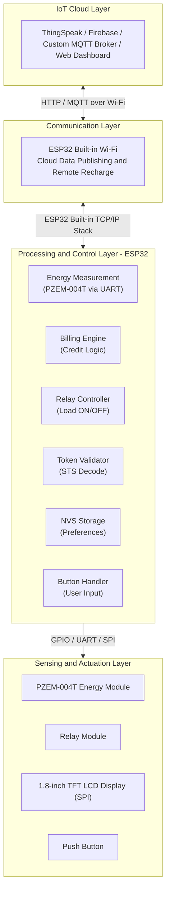
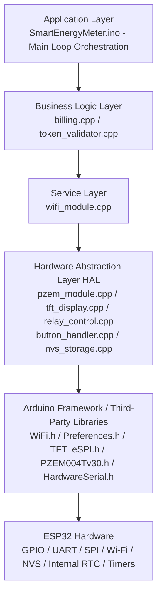
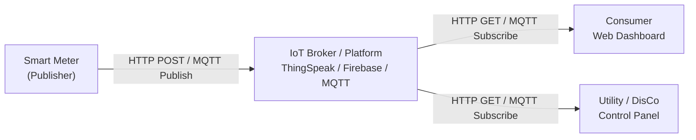

# Design and Implementation of an Advanced IoT-Based Smart Prepaid Energy Meter
 
**Simulation Tool:** Proteus Design Suite 8  
**Microcontroller Platform:** ESP32  
**Target Market:** Nigerian Electricity Distribution Sector  
**Date:** February 2026  
**Repository:** [https://github.com/thetruesammyjay/Iot-Based-Smart-Prepaid-Energy-Meter-Proteus](https://github.com/thetruesammyjay/Iot-Based-Smart-Prepaid-Energy-Meter-Proteus)  

---

## Table of Contents

1. [Project Overview](#1-project-overview)
2. [Problem Statement](#2-problem-statement)
3. [Objectives](#3-objectives)
4. [System Architecture](#4-system-architecture)
5. [Hardware Components](#5-hardware-components)
6. [Software Architecture](#6-software-architecture)
7. [Core Functional Modules](#7-core-functional-modules)
8. [IoT Integration Design](#8-iot-integration-design)
9. [Billing and Token Algorithm](#9-billing-and-token-algorithm)
10. [Proteus Simulation Design](#10-proteus-simulation-design)
11. [Running the Simulation](#11-running-the-simulation)
12. [Firmware Build Instructions](#12-firmware-build-instructions)
13. [System Workflow](#13-system-workflow)
14. [Testing and Validation](#14-testing-and-validation)
15. [Limitations and Future Work](#15-limitations-and-future-work)
16. [References](#16-references)

---

## 1. Project Overview

This project presents the design and implementation of an Advanced IoT-Based Smart Prepaid Energy Meter, developed as a simulation-driven prototype using Proteus Design Suite 8. The system addresses the operational and financial inefficiencies inherent in traditional postpaid electricity metering by integrating embedded systems design, real-time energy measurement, prepaid billing logic, and IoT-based remote communication into a unified solution.

The meter measures electrical energy consumed by a load in real time, deducts from a preloaded credit balance, and disconnects the load automatically upon credit exhaustion. Consumers can recharge the meter remotely via SMS token delivery or an IoT web dashboard. Utility providers gain access to centralized consumption data without requiring physical meter reading.

The entire system — from the microcontroller firmware to the hardware peripherals — is modelled and validated within a Proteus virtual environment, enabling full functional testing prior to physical prototyping.

This project is designed with the Nigerian electricity market in mind, where a documented metering gap, widespread estimated billing practices by Distribution Companies (DisCos), and infrastructure constraints under the Nigerian Electricity Regulatory Commission (NERC) framework present unique deployment challenges that a smart prepaid metering solution is positioned to address.

---

## 2. Problem Statement

Conventional postpaid electricity metering systems present several well-documented challenges:

- **Revenue Loss:** Delayed billing cycles and meter reading inaccuracies result in significant revenue leakage for utility companies.
- **Manual Infrastructure Costs:** Physical meter reading requires large field workforces and introduces human error.
- **Consumer Debt Accumulation:** Postpaid consumers often accumulate unpayable debts, leading to service disconnection disputes.
- **Lack of Consumption Transparency:** Consumers have no real-time visibility into their energy usage, making proactive conservation difficult.
- **Disconnection Inefficiency:** Remote load disconnection for non-payment is not feasible in traditional analog metering systems.
- **Estimated Billing (Nigeria-Specific):** Nigerian DisCos have historically issued estimated bills to unmetered consumers, resulting in arbitrary and often inflated invoices that impose financial hardship on households and businesses.
- **National Metering Gap:** NERC has documented a metering gap in which millions of electricity consumers lack functional meters. The federal government's National Mass Metering Programme (NMMP) was launched specifically to address this deficit, creating a policy-driven demand for smart prepaid meter deployment.
- **NERC Band-Based Tariff Complexity:** Nigeria's Multi-Year Tariff Order (MYTO) introduces a Band A–E pricing structure tied to daily hours of electricity supply. A compliant metering solution must support a configurable, band-aware tariff engine to accurately reflect consumer-specific billing rates.

An IoT-enabled prepaid metering solution directly resolves these challenges by shifting billing to a pay-before-use model, automating load control, and enabling bidirectional communication between consumer devices and utility infrastructure.

---

## 3. Objectives

The specific objectives of this project are as follows:

1. To design a microcontroller-based circuit capable of measuring real-time voltage, current, active power, and cumulative energy consumption (kWh).
2. To implement a prepaid billing engine that deducts credit in proportion to energy consumed at a configurable tariff rate.
3. To control a relay actuator that automatically disconnects the consumer load when credit reaches zero and reconnects it upon successful recharge.
4. To develop a token-based recharge mechanism compliant with Standard Transfer Specification (STS) principles, deliverable via push button entry or an IoT dashboard.
5. To leverage the ESP32 built-in Wi-Fi module for real-time data publishing to an IoT platform and remote recharge command reception.
6. To persist meter state (credit balance, cumulative consumption) in the ESP32 Non-Volatile Storage (NVS), ensuring data retention across power cycles.
7. To simulate the complete hardware and firmware stack using Proteus Design Suite 8 to validate system behaviour before physical implementation.

---

## 4. System Architecture

The system is structured into four interconnected layers:



### Data Flow Summary

1. The PZEM-004T energy measurement module continuously measures AC voltage, current, active power, and cumulative energy, delivering pre-computed digital values to the ESP32 via UART/Modbus.
2. The firmware reads these values at a configurable sampling interval and feeds them into the billing engine.
3. The billing engine converts kWh to monetary cost and decrements the stored credit balance in ESP32 NVS.
4. When credit reaches zero, the relay control module opens the relay, disconnecting the load.
5. A consumer presses the push button to navigate the recharge menu on the TFT LCD. The token validator verifies the entered token and credits the balance.
6. Alternatively, a token is pushed by the IoT dashboard over the ESP32 built-in Wi-Fi connection.
7. All operational data — voltage, current, power, balance — is displayed on the 1.8-inch TFT LCD and published to the IoT cloud.

---

## 5. Hardware Components

The following components constitute the physical (and simulated) hardware of the system. Each component is available in the Proteus component library or can be imported via a third-party Proteus model.

### 5.1 Microcontroller

| Component | Model | Justification |
|---|---|---|
| Microcontroller | ESP32 | Dual-core 32-bit processor, built-in Wi-Fi/BT, 4MB flash, 520KB SRAM, multiple UART/SPI/I2C, Arduino IDE compatible |

### 5.2 Sensing Components

| Component | Model | Role |
|---|---|---|
| Energy Measurement Module | PZEM-004T | Dedicated AC energy meter module; measures voltage, current, power, energy, frequency, and power factor; communicates via UART/Modbus |

> Note: The PZEM-004T handles all AC signal conditioning and measurement internally. It eliminates the need for discrete current sensors, voltage dividers, and firmware-level RMS computation. In the Proteus simulation, the PZEM-004T is modelled via a Virtual Terminal component communicating over a hardware UART channel.

### 5.3 Display and Input

| Component | Model | Role |
|---|---|---|
| LCD Display | 1.8-inch TFT LCD (ST7735/ILI9163 driver) | Colour graphical display of voltage, current, power, credit balance, and alerts via SPI |
| Input | Push Button | User interaction for recharge menu navigation and token confirmation |

### 5.4 Communication Modules

| Component | Model | Interface | Role |
|---|---|---|---|
| Wi-Fi Module | ESP32 Built-in Wi-Fi (802.11 b/g/n) | Native TCP/IP stack | IoT dashboard data publishing via HTTP/MQTT; remote recharge command reception |

> Note: The ESP32's built-in Wi-Fi eliminates the need for a separate communication module. In Proteus simulation, the Wi-Fi interface is modelled as a Virtual Terminal component to validate firmware communication logic.

### 5.5 Power Control

| Component | Model | Role |
|---|---|---|
| Relay Module | 5V Single-Channel Relay | Electromechanical load disconnection upon zero credit |
| Flyback Diode | 1N4007 | Protects the MCU GPIO from relay coil back-EMF |

### 5.6 Data Persistence and Timekeeping

| Component | Model | Interface | Role |
|---|---|---|---|
| NVS Storage | ESP32 Non-Volatile Storage (Preferences library) | Internal SPI flash | Persistent storage of credit balance, cumulative kWh, relay state, and used token records across power cycles |
| RTC | ESP32 Internal RTC (NTP-synced) | Built-in | Timekeeping for consumption log timestamping; synchronised over Wi-Fi using NTP |

> The ESP32's Preferences library provides key-value NVS storage backed by internal SPI flash. No external EEPROM or RTC module is required.

### 5.7 Power Supply

| Component | Specification |
|---|---|
| DC Power Supply | 5V regulated supply for MCU and peripherals |
| AC Load Supply | 230V AC sinusoidal source (simulated in Proteus) |

---

## 6. Software Architecture

The firmware is written in embedded C++ using the Arduino framework and follows a modular, single-responsibility design. The software is organized into the following architectural layers:



### Design Principles Applied

- **Separation of Concerns:** Each peripheral is encapsulated in its own module with a defined header interface, preventing tight coupling between subsystems.
- **Single Responsibility Principle:** Each `.cpp` file is responsible for exactly one system concern.
- **Non-Blocking Execution:** The main loop uses time-based scheduling (via `millis()`) rather than `delay()` to ensure concurrent operation of display refresh, ADC sampling, and communication polling.
- **Defensive Programming:** All NVS read operations validate stored data against known sentinel values to detect first-boot or corrupted state conditions.

---

## 7. Core Functional Modules

### 7.1 Energy Measurement Module (`pzem_module`)

This module manages communication with the PZEM-004T dedicated energy measurement module via UART using the Modbus RTU protocol.

**PZEM-004T Measurement Approach:**
Unlike ADC-based approaches that require firmware-level RMS computation, the PZEM-004T handles all AC signal conditioning and measurement internally. The ESP32 sends a Modbus RTU read request over UART, and the PZEM-004T responds with pre-computed values for:

- **Voltage (V RMS):** Line voltage in the range 80–260V
- **Current (A RMS):** Load current in the range 0–100A
- **Active Power (W):** Instantaneous real power delivered to the load
- **Cumulative Energy (kWh):** Total energy consumed since last reset
- **Frequency (Hz):** Mains supply frequency
- **Power Factor:** Ratio of active to apparent power

**Energy and Power Relationships:**

Active power delivered to the load:

$$P_{active} = V_{RMS} \times I_{RMS} \times PF$$

where $PF$ is the power factor reported by the PZEM-004T.

Cumulative energy in kilowatt-hours:

$$E = \int_{0}^{T} P \, dt \approx \sum_{k} P_k \cdot \Delta t_k \times \frac{1}{3{,}600{,}000}$$

where $\Delta t_k$ is the sampling interval in milliseconds.

### 7.2 Billing Engine (`billing`)

The billing engine converts energy consumption to a monetary cost and manages the prepaid credit balance.

- **Tariff Rate:** Configurable cost per kWh in Nigerian Naira (e.g., ₦68.00/kWh for NERC Band B residential), stored in firmware constants and adjustable via EEPROM. The system supports the NERC Multi-Year Tariff Order (MYTO) Band A–E structure by allowing the tariff rate to be updated remotely via the IoT dashboard.
- **Credit Deduction:** At each billing interval (configurable, default: every 1 second), the incremental energy consumed is costed and deducted from the stored balance.
- **Low-Balance Alert:** When the balance falls below a configurable threshold (e.g., ₦500.00), an alert is displayed on the TFT LCD and a notification is published to the IoT platform via the ESP32 built-in Wi-Fi module.
- **Zero-Credit Cutoff:** When the balance reaches ₦0.00, the relay control module is invoked to disconnect the load.

### 7.3 Token Validator (`token_validator`)

The recharge token system is modelled on Standard Transfer Specification (STS) IEC 62055-41 principles.

- Tokens are 20-digit numeric codes generated by a utility authority and cryptographically bound to a specific meter serial number and credit value.
- On token entry, the validator decodes the token, verifies the meter ID match, checks the one-time-use flag in EEPROM, and credits the decoded value to the balance.
- Invalid or already-used tokens are rejected with an error message on the TFT LCD.

> In the simulation context, tokens are pre-generated strings verified against a lookup table stored in program memory (PROGMEM), since full STS cryptographic implementation (DKGA04 algorithm) is beyond the scope of the Proteus simulation.

### 7.4 Relay Control Module (`relay_control`)

Manages the state of the relay that controls load connectivity:

- `relay_on()` — energizes the relay coil, closing the circuit and enabling the load.
- `relay_off()` — de-energizes the relay coil, opening the circuit and disconnecting the load.
- Relay state is stored in EEPROM to recover correctly after a power cycle.

### 7.5 TFT Display Module (`tft_display`)

Abstracts the 1.8-inch TFT LCD (SPI) into application-level rendering functions:

- **Home Screen:** Displays real-time voltage (V), current (A), power (W), and remaining credit balance with colour-coded indicators.
- **Alert Screen:** Displays low-balance warning in red and estimated energy remaining.
- **Recharge Screen:** Prompts for token confirmation via push button and confirms successful recharge.
- **Status Screen:** Displays relay state, Wi-Fi connection status, and last IoT publish timestamp.

### 7.6 Push Button Handler (`button_handler`)

Manages the push button input with software debouncing:

- Detects short press and long press events to navigate the on-screen recharge menu.
- Cycles through token digit entry on short press; confirms selection on long press.
- Enforces a configurable lockout period after three consecutive failed token entries as a tamper deterrent.

### 7.7 Wi-Fi Module (`wifi_module`)

Utilises the ESP32's built-in Wi-Fi (802.11 b/g/n) via the native `WiFi.h` and `HTTPClient.h` libraries:

- Connects to a configured Wi-Fi SSID at startup using credentials stored in NVS.
- Publishes energy readings and credit balance to an IoT platform (e.g., ThingSpeak) via HTTP GET/POST requests at a configurable interval.
- Receives recharge commands from the IoT dashboard web interface via HTTP polling or MQTT subscription.
- No AT commands are required; the ESP32 handles the full TCP/IP stack natively.

### 7.8 NVS Storage (`nvs_storage`)

Provides persistent key-value storage across power cycles using the ESP32 Preferences library backed by internal SPI flash NVS partitions:

| Key | Data | Size |
|---|---|---|
| `CREDIT_BALANCE` | Current monetary balance (float) | 4 bytes |
| `CUMULATIVE_KWH` | Total lifetime energy consumption (float) | 4 bytes |
| `RELAY_STATE` | Last relay state (byte: 0 or 1) | 1 byte |
| `METER_ID` | Unique meter serial number (uint32_t) | 4 bytes |
| `TOKEN_LOG` | Circular buffer of last 10 used token hashes | 80 bytes |
| `TARIFF_RATE` | Cost per kWh (float) | 4 bytes |
| `WIFI_SSID` | Configured Wi-Fi network name (string) | variable |
| `WIFI_PASS` | Configured Wi-Fi password (string) | variable |


## 8. IoT Integration Design

### 8.1 Architecture Pattern

The IoT layer follows a **Publish-Subscribe** pattern for telemetry and a **Request-Response** pattern for remote recharge commands.



### 8.2 Published Data Fields

The following data fields are transmitted to the IoT platform at each publish interval (default: every 15 seconds):

| Field | Type | Unit | Description |
|---|---|---|---|
| `voltage` | float | V | RMS line voltage |
| `current` | float | A | RMS load current |
| `power` | float | W | Active power |
| `energy_kwh` | float | kWh | Cumulative energy |
| `credit_balance` | float | Currency | Remaining balance |
| `relay_state` | int | - | 1 = connected, 0 = disconnected |
| `timestamp` | string | ISO 8601 | NTP-sourced timestamp from ESP32 internal RTC |

### 8.3 Remote Recharge via IoT Dashboard

1. A utility operator generates a recharge token from the dashboard.
2. The token is pushed to the IoT platform as a command payload.
3. The ESP32 built-in Wi-Fi module polls the platform and retrieves the pending command.
4. The token string is forwarded to the token validator module over the internal serial bus.
5. Upon successful validation, the balance is credited and the relay is engaged if previously disconnected.

---

## 9. Billing and Token Algorithm

### 9.1 Credit Deduction Loop

The billing deduction executes every `BILLING_INTERVAL_MS` milliseconds (default: 1000ms) within the main firmware loop:

```
energy_increment (Wh)  = P_active (W) x (BILLING_INTERVAL_MS / 3,600,000)
energy_increment (kWh) = energy_increment (Wh) / 1000
cost_increment         = energy_increment (kWh) x TARIFF_RATE (₦/kWh)
credit_balance         = credit_balance - cost_increment
```

The updated balance is written to EEPROM immediately after each deduction to ensure consistency in the event of a power failure.

### 9.2 Token Structure (Simplified STS Model)

For this simulation, tokens are structured as follows:

```
[4-digit Meter ID Prefix] [12-digit Encoded Value] [4-digit Checksum]
```

Example: `1234 560000150000 7891`

- **Meter ID Prefix:** Must match the meter's stored ID; prevents tokens intended for other meters from being used.
- **Encoded Value:** Encodes the credit amount and token class (standard top-up, maintenance, test).
- **Checksum:** A 4-digit CRC computed over the first 16 digits; used to detect manually forged tokens.

---

## 10. Proteus Simulation Design

### 10.1 Overview

The Proteus simulation replicates the entire hardware system in a virtual environment. All signal interactions - UART communication, SPI display rendering, relay switching, and TFT LCD output - are fully functional within the simulation. No physical hardware is required to validate the system.

### 10.2 Simulated Components and Their Proteus Equivalents

| Physical Component | Proteus Component / Model | Library |
|---|---|---|
| ESP32 | `ESP32` (or generic 32-bit MCU with UART/SPI GPIO) | ESP32 / custom model |
| PZEM-004T Energy Module | `VIRTUAL TERMINAL` (UART terminal) | Virtual Instruments |
| 1.8" TFT LCD (ST7735/ILI9163) | `SSD1306 OLED` or SPI display model (closest available) | Display / custom |
| Push Button | `BUTTON` (generic push button) | ACTIVE |
| 5V Relay Module | `RELAY` (generic coil-driven relay) | ACTIVE |
| AC Load | Lamp or resistive load model | ACTIVE |
| 230V AC Source | `VSINE` (AC voltage generator) | Generators |

### 10.3 Simulation Constraints and Approximations

The following approximations are made in the Proteus environment due to simulation limitations:

1. **Wi-Fi Simulation:** Physical RF communication cannot be simulated in Proteus. The ESP32 built-in Wi-Fi is represented by a Virtual Terminal component. Network command sequences are pre-scripted or manually entered to simulate IoT publish/subscribe interactions during demonstration.

2. **PZEM-004T Model:** The PZEM-004T does not exist natively in the Proteus library. It is represented by a Virtual Terminal component configured at the appropriate UART baud rate, with Modbus RTU response frames pre-scripted to simulate energy measurement data delivery to the ESP32.

3. **TFT LCD Rendering:** The specific ST7735/ILI9163 TFT LCD driver may not be available natively in Proteus. A substitute SPI display model is used, or display output is validated through logic analyser probes on the SPI bus lines.

4. **NVS Persistence:** Proteus does not simulate SPI flash NVS partition behaviour. EEPROM or RAM-backed storage models are used as functional equivalents to validate persistence logic within the simulation context.

### 10.4 Proteus Circuit Connections Summary

#### ESP32 GPIO Pin Assignments

| Pin | Function | Connected To |
|---|---|---|
| GPIO16 (RX2) | UART2 RX - PZEM-004T | PZEM-004T TX |
| GPIO17 (TX2) | UART2 TX - PZEM-004T | PZEM-004T RX |
| GPIO4 | Digital Output - Relay Control | Relay module IN pin |
| GPIO0 | Digital Input - Push Button | Push button with pull-up |
| GPIO18 (SCK) | SPI Clock - TFT LCD | TFT CLK pin |
| GPIO19 (MISO) | SPI MISO (not used for TFT write-only) | - |
| GPIO23 (MOSI) | SPI Data - TFT LCD | TFT DIN/MOSI pin |
| GPIO5 (CS) | SPI Chip Select - TFT LCD | TFT CS pin |
| GPIO21 | TFT DC/RS (Data/Command) | TFT DC pin |
| GPIO22 | TFT Reset | TFT RST pin |
| GND | Ground | All component GND |
| 3.3V / 5V | Power | Component VCC as required |

---

## 11. Running the Simulation

### 11.1 Prerequisites

- **Proteus Design Suite 8.x** (version 8.9 or later recommended)
- **Arduino IDE 2.x** with Espressif Arduino Core installed (required only if recompiling the firmware)
- ESP32 board package: install via Arduino IDE Board Manager (`esp32` by Espressif Systems)
- Third-party Proteus models (if not built-in): ESP32 Proteus library (available from community repositories)

### 11.2 Step-by-Step Simulation Procedure

**Step 1 — Open the Project**
1. Launch Proteus Design Suite 8.
2. Navigate to `File > Open Project` and select `proteus/SmartEnergyMeter.pdsprj`.
3. The schematic will load with all components placed and wired.

**Step 2 — Verify the HEX File Assignment**
1. Double-click the ESP32 component in the schematic to open its properties.
2. In the `Program File` field, ensure the path points to `proteus/SmartEnergyMeter.hex`.
3. Set the `Clock Frequency` to `240MHz` to match the ESP32 hardware specification.
4. Click `OK` to confirm.

**Step 3 — Configure the Virtual Terminals (PZEM-004T and Wi-Fi)**
1. Double-click each Virtual Terminal component and set `Baud Rate` to `9600`, `Data Bits` to `8`, `Parity` to `None`, `Stop Bits` to `1`.
2. These terminals will display UART/Modbus traffic (PZEM-004T) and Wi-Fi communication sequences during simulation.

**Step 4 — Run the Simulation**
1. Click the `Play` button (green triangle) in the Proteus toolbar or press `F12`.
2. The simulation will initialize. The LCD should display the meter home screen after approximately 2 simulation seconds.
3. Observe the displayed voltage, current, power, and credit balance values on the TFT LCD.

**Step 5 — Simulate Token Recharge**
1. Click on the push button component to simulate a button press and navigate to the recharge menu on the TFT LCD.
2. Use repeated short presses to cycle token digit values and a long press to confirm each digit (refer to `docs/simulation-guide.md` for the button interaction model).
3. Observe the TFT LCD transitioning to the recharge confirmation screen and the balance updating.

**Step 6 — Simulate Credit Exhaustion**
1. In the firmware source, reduce the initial credit balance constant to a small value (e.g., $0.10) and recompile.
2. Reload the HEX file in the Proteus component properties.
3. Run the simulation and observe the relay switching to open state and the LCD displaying a "POWER DISCONNECTED" message when credit reaches zero.

**Step 7 — Observe PZEM-004T Communication**
1. With the simulation running, the Virtual Terminal assigned to the PZEM-004T module will display Modbus RTU request/response frames as the firmware polls for energy data.

### 11.3 Recompiling the Firmware

If changes are made to the firmware source code:

1. Open `firmware/SmartEnergyMeter.ino` in the Arduino IDE.
2. Select `Tools > Board > ESP32 Arduino > ESP32 Dev Module` (or your specific ESP32 board variant).
3. Select `Tools > Port` (port selection is not required for HEX export).
4. Navigate to `Sketch > Export Compiled Binary`.
5. Locate the generated `SmartEnergyMeter.ino.hex` file in the `firmware/` directory.
6. Copy this file to `proteus/SmartEnergyMeter.hex`, replacing the existing file.
7. Return to Proteus and re-run the simulation.

---

## 12. Firmware Build Instructions

### 12.1 Required Libraries

Install the following libraries via the Arduino IDE Library Manager (`Sketch > Include Library > Manage Libraries`):

| Library Name | Version | Purpose |
|---|---|---|
| `TFT_eSPI` | >= 2.5.0 | 1.8" TFT LCD via SPI (ST7735/ILI9163 driver support) |
| `PZEM-004T-v30` | >= 1.1.2 | PZEM-004T energy module UART/Modbus communication |
| `WiFi` | Built-in (ESP32 Core) | ESP32 built-in Wi-Fi TCP/IP stack |
| `HTTPClient` | Built-in (ESP32 Core) | HTTP GET/POST for IoT platform publishing |
| `Preferences` | Built-in (ESP32 Core) | ESP32 NVS key-value persistent storage |
| `HardwareSerial` | Built-in (ESP32 Core) | Hardware UART for PZEM-004T communication |

### 12.2 Configuration Constants

The following constants in `SmartEnergyMeter.ino` must be configured before compilation:

```cpp
#define METER_ID            1234            // Unique meter identifier (must match token prefix)
#define TARIFF_RATE         68.00f          // NERC Band B residential tariff rate (₦/kWh)
                                            // Band A: ~₦206.80 | Band B: ~₦68.00 |
                                            // Band C: ~₦50.00  | Band D: ~₦43.00 | Band E: ~₦40.00
#define INITIAL_BALANCE     2000.00f        // Default credit balance in Naira (₦) for demonstration
#define LOW_BALANCE_THRESH  500.00f         // Low-balance alert threshold in Naira (₦)
#define BILLING_INTERVAL_MS 1000            // Billing deduction interval in milliseconds
#define PZEM_RX_PIN         16              // ESP32 GPIO pin for PZEM-004T UART RX
#define PZEM_TX_PIN         17              // ESP32 GPIO pin for PZEM-004T UART TX
#define RELAY_PIN           4               // ESP32 GPIO pin for relay control
#define BUTTON_PIN          0               // ESP32 GPIO pin for push button input
#define WIFI_SSID           "YourSSID"      // Wi-Fi network name
#define WIFI_PASSWORD       "YourPassword"  // Wi-Fi password
#define IOT_SERVER          "api.thingspeak.com" // IoT platform API endpoint
#define IOT_API_KEY         "YOUR_API_KEY"       // ThingSpeak channel write API key
```

---

## 13. System Workflow

### 13.1 Main Firmware Loop


---

## 14. Testing and Validation

The following test scenarios are used to validate the system against its design objectives within the Proteus simulation:

| Test ID | Scenario | Expected Outcome | Validation Method |
|---|---|---|---|
| TC-01 | Power-on with stored credit balance | TFT LCD displays correct balance from NVS on startup | Visual inspection of TFT LCD in Proteus |
| TC-02 | PZEM-004T providing energy readings via UART | V, I, P, and kWh values read and displayed correctly | Compare PZEM-004T Virtual Terminal output against displayed TFT values |
| TC-03 | Credit balance decrements over time | Balance decreases at the rate: tariff × power / 3,600,000 per ms | Plot balance vs. time in Proteus graph tool |
| TC-04 | Valid token entered via push button menu | Balance increases by the token's credit value; relay closes if previously open | Visual inspection of TFT LCD and relay state indicator |
| TC-05 | Invalid token entered | TFT LCD displays "INVALID TOKEN" error; balance unchanged | Visual inspection |
| TC-06 | Already-used token re-entered | TFT LCD displays "TOKEN ALREADY USED"; balance unchanged | NVS token log verification |
| TC-07 | Balance reaches zero | Relay opens; TFT LCD displays "CREDIT EXHAUSTED"; load lamp extinguishes | Relay component state in Proteus |
| TC-08 | Low-balance threshold crossed | Wi-Fi Virtual Terminal shows HTTP publish request with low-balance flag | Virtual Terminal output in Proteus |
| TC-09 | Power cycle during active session | Balance and relay state restore correctly from NVS on restart | Stop and restart simulation; verify TFT LCD values |
| TC-10 | IoT telemetry publish interval | Wi-Fi Virtual Terminal shows HTTP request string at correct interval | Virtual Terminal output and oscilloscope probe in Proteus |

---

## 15. Limitations and Future Work

### 15.1 Current Limitations

- **Simulation Fidelity:** Proteus does not simulate RF communication for the ESP32 built-in Wi-Fi module. Full end-to-end IoT data flow requires physical hardware deployment.
- **STS Cryptography:** The full DKGA04 token generation and validation algorithm (as specified in IEC 62055-41) is not implemented due to its computational complexity in the simulation scope. A simplified lookup-based model is used.
- **Power Factor:** The PZEM-004T module reports power factor in addition to active power, enabling more accurate real power billing than ADC-only approaches. However, highly non-linear loads (variable speed drives, switched-mode power supplies) may require dedicated power quality analysis beyond the PZEM-004T's measurement range.
- **Tamper Detection:** Physical tampering countermeasures (optical sensors, magnetic field detectors) cannot be evaluated in simulation.

### 15.2 Recommended Future Enhancements

1. **Dedicated Energy Metering IC Upgrade:** Consider replacing the PZEM-004T module with a dedicated energy metering IC such as the ADE7758 or CS5463 for tighter integration with the ESP32 and hardware-level harmonic analysis capability.
2. **Full STS Compliance:** Implement the complete STS IEC 62055-41 DKGA04 cryptographic token generation and validation algorithm.
3. **MQTT Protocol:** Replace HTTP polling with MQTT publish-subscribe for lower-latency, lower-bandwidth IoT communication.
4. **Over-the-Air (OTA) Firmware Update:** Leverage the ESP32's built-in OTA capability (via `ArduinoOTA` or ESP-IDF OTA) to enable remote firmware updates without physical access to the device.
5. **TFT Touchscreen Interface:** Replace the push button with a capacitive touch TFT display for a richer and more intuitive consumer-facing interface.
6. **Physical PCB Design:** Translate the validated Proteus schematic to a manufacturable PCB layout using the Proteus ARES PCB design module.
7. **Tamper-Evident Enclosure:** Design an IP54-rated enclosure with anti-tamper seals for physical deployment in outdoor environments.

---

## 16. References

1. International Electrotechnical Commission. (2014). *IEC 62055-41: Electricity Metering — Payment Systems — Standard Transfer Specification (STS) — Part 41: Application Layer Protocol for One-Way Token Carrier Systems.* IEC.
2. Espressif Systems. (2023). *ESP32 Technical Reference Manual* (Version 5.0). Espressif Systems.
3. PEACEFAIR. (2022). *PZEM-004T Power Energy Meter Module: User Manual and Communication Protocol.* PEACEFAIR Electronic.
4. Labcenter Electronics. (2022). *Proteus Design Suite Professional — User Manual v8.15.* Labcenter Electronics Ltd.
5. Amin, M., & Wollenberg, B. F. (2005). Toward a Smart Grid: Power Delivery for the 21st Century. *IEEE Power and Energy Magazine*, 3(5), 34–41.
6. Depuru, S. S. S. R., Wang, L., & Devabhaktuni, V. (2011). Smart Meters for Power Grid: Challenges, Issues, Advantages and Status. *Renewable and Sustainable Energy Reviews*, 15(6), 2736–2742.
7. Nigerian Electricity Regulatory Commission (NERC). (2022). *Multi-Year Tariff Order (MYTO) 2.1 — Minimum Remittable Tariff and Band Classification.* NERC, Abuja, Nigeria.
8. Federal Ministry of Power, Nigeria. (2021). *National Mass Metering Programme (NMMP) — Phase 0 Report.* Federal Government of Nigeria.
9. Iwayemi, A. (2008). Nigeria's Dual Energy Problems: Policy Issues and Challenges. *International Association for Energy Economics Newsletter*, 17(4), 17–21.

---

**Project Author:** Ifiezibe Samuel  
**Target Market:** Nigerian Electricity Distribution Sector (NERC-regulated DisCos)  
**Repository:** [https://github.com/thetruesammyjay/Iot-Based-Smart-Prepaid-Energy-Meter-Proteus](https://github.com/thetruesammyjay/Iot-Based-Smart-Prepaid-Energy-Meter-Proteus)
