# CHAPTER THREE

# SYSTEM DESIGN AND METHODOLOGY

## 3.1 Introduction

This chapter presents the complete design and methodology adopted for the development of the IoT-based Smart Prepaid Energy Meter. It describes the overall system architecture, the hardware and software design decisions, the firmware structure, the validation environment, and the step-by-step development methodology applied throughout the project. The chapter also provides circuit-level detail, module-to-module interface definitions, and test planning criteria that form the basis for verification in the implementation phase.

The design follows an iterative prototyping lifecycle that integrates modular embedded software design with firmware validation and hardware bench testing. Each functional subsystem is described independently and then shown as part of the integrated system. Mermaid diagrams are used throughout to illustrate data flow, control logic, hardware connectivity, and lifecycle stages [1].

---

## 3.2 Development Methodology

### 3.2.1 Adopted Methodology: Iterative Prototyping with Modular Object-Oriented Design

The project adopts an **Iterative Prototyping Methodology** combined with **Modular Object-Oriented Firmware Design**. This combination is appropriate for embedded IoT projects where hardware-software co-design proceeds in incremental stages, each of which must be verified before the next stage begins.

Iterative prototyping allows the designer to build a working version of each subsystem, test it in isolation, then integrate it with others. This is better suited to embedded development than a strictly waterfall approach because embedded systems reveal integration problems — timing conflicts, bus contention, memory pressure — that are difficult to predict in a pure design phase.

The modular object-oriented design style structures the firmware into independent C++ source modules with clearly defined interfaces. Each module owns its data and exposes only the functions that other modules need to call. This reduces coupling, makes testing simpler, and allows individual modules to be changed without affecting the rest of the firmware.

### 3.2.2 Lifecycle Phases

The iterative lifecycle of this project consists of seven phases as illustrated below:

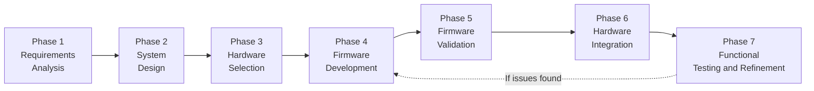

**Phase 1 — Requirements Analysis**
Functional requirements are identified from the problem statement: real-time energy measurement, prepaid credit deduction, relay-based load disconnection, token-based recharge, IoT data publishing, and non-volatile state persistence. Non-functional requirements include single-phase AC operation, modular firmware structure, Wokwi validation compatibility, and Nigerian NERC tariff configurability.

**Phase 2 — System Design**
The system is divided into hardware subsystems and firmware modules. Interfaces between subsystems are defined: communication protocols (UART for PZEM-004T, SPI for TFT LCD, GPIO for relay and buttons), data formats (Modbus RTU frames, HTTP payloads), and state variables (credit balance, relay state, token log, cumulative kWh).

**Phase 3 — Hardware Selection**
Components are selected based on availability for the physical prototype, compatibility with the Arduino ESP32 ecosystem, low cost, and suitability for the Nigerian market context. Each selected component is justified against the functional requirements.

**Phase 4 — Firmware Development**
Each firmware module is developed and unit-tested independently before integration. The modules are: `pzem_module`, `billing_engine`, `token_validator`, `relay_control`, `tft_display`, `button_handler`, `wifi_module`, and `nvs_storage`.

**Phase 5 — Firmware Validation**
The firmware is first validated in Wokwi using mocked peripheral inputs and serial output checks. This stage confirms module interactions, basic control flow, and token handling before any hardware wiring is finalised.

**Phase 6 — Hardware Integration**
The ESP32, PZEM-004T, TFT LCD, relay, push buttons, and power supply are wired together on the physical prototype once the firmware logic has been confirmed.

**Phase 7 — Functional Testing and Documentation**
Firmware logic is adjusted where bench results reveal unexpected behaviour. All design decisions, test results, and validation evidence are documented.

---

## 3.3 System Architecture

### 3.3.1 Overall Architecture Overview

The system is organised into four hierarchical layers: the Sensing and Actuation Layer, the Processing and Control Layer, the Communication Layer, and the IoT Cloud Layer. Each layer depends on the one below it for data and control services.

```mermaid
graph TD
    subgraph Cloud["IoT Cloud Layer"]
        TS["ThingSpeak Dashboard\nData Visualisation and Remote Recharge"]
    end

    subgraph Comm["Communication Layer"]
        WIFI["ESP32 Built-in Wi-Fi (802.11 b/g/n)\nHTTP Publish and Remote Command Polling"]
    end

    subgraph Proc["Processing and Control Layer — ESP32"]
        EM["pzem_module\nEnergy Measurement via UART/Modbus"]
        BE["billing_engine\nCredit Deduction Logic"]
        RC["relay_control\nLoad Connect/Disconnect"]
        TV["token_validator\nSTS Token Recharge"]
        NVS["nvs_storage\nPreferences Key-Value Persistence"]
        BTN["button_handler\nUser Input and Recharge Menu"]
        DISP["tft_display\nConsumer-Facing GUI"]
        WIFI_M["wifi_module\nTelemetry and Command Service"]
    end

    subgraph Sense["Sensing and Actuation Layer"]
        PZEM["PZEM-004T\nAC Energy Measurement Module"]
        RL["5V Relay Module\nLoad Switching"]
        LCD["1.8-inch TFT LCD\nST7735 / ILI9163 Driver"]
        PB["Push Button\nUser Interaction"]
        LOAD["AC Load\n230V Single-Phase"]
        AC["230V AC Source\nBench Supply / Test Load"]
    end

    Cloud <-->|"HTTP REST over Wi-Fi"| Comm
    Comm <-->|"ESP32 Native TCP/IP Stack"| Proc
    EM <-->|"UART2 / Modbus RTU"| PZEM
    RC -->|"GPIO4 Digital Output"| RL
    DISP -->|"SPI Bus"| LCD
    BTN <--|"GPIO0 Digital Input"| PB
    RL --> LOAD
    LOAD --> AC
```

### 3.3.2 Data Flow Within the System

The operational data flow proceeds through the following sequence in each firmware cycle:

```mermaid
sequenceDiagram
    participant PZEM as PZEM-004T
    participant ESP as ESP32 Firmware
    participant NVS as NVS Storage
    participant Relay as Relay Module
    participant LCD as TFT Display
    participant Cloud as ThingSpeak

    PZEM->>ESP: Modbus RTU Response (V, I, P, kWh, freq, PF)
    ESP->>ESP: Compute delta_kWh and cost_increment
    ESP->>NVS: Deduct cost from credit_balance; write updated balance
    ESP->>ESP: Compare balance against thresholds
    alt balance <= 0
        ESP->>Relay: relay_off() — disconnect load
        ESP->>LCD: Display CREDIT EXHAUSTED screen
    else balance < LOW_BALANCE_THRESH
        ESP->>LCD: Display low-balance warning
        ESP->>Cloud: Publish low-balance alert
    else balance sufficient
        ESP->>LCD: Refresh home screen with parameters
    end
    ESP->>Cloud: Publish telemetry at publish interval
    ESP->>ESP: Poll button for recharge menu input
    ESP->>ESP: Poll Wi-Fi for remote recharge command
```

---

## 3.4 Hardware Design

### 3.4.1 Component Selection

The hardware components were selected based on the following criteria: (a) availability for the physical prototype and firmware validation workflow; (b) compatibility with the Arduino ESP32 ecosystem; (c) appropriateness for the target Nigerian single-phase 230V / 50Hz AC environment; and (d) low cost relative to commercially available smart meter alternatives.

| Component | Selected Model | Selection Rationale |
|---|---|---|
| Microcontroller | ESP32 (Espressif) | Dual-core 32-bit, 240 MHz, 4MB flash, 520KB SRAM, integrated Wi-Fi, hardware UART, SPI, I2C, GPIO |
| Energy Measurement | PZEM-004T v3.0 | Dedicated AC measurement module; provides V, I, P, kWh, Hz, PF via UART/Modbus; eliminates custom ADC front-end |
| Display | 1.8-inch TFT LCD (ST7735 / ILI9163) | 128×160 colour SPI display; suitable for real-time parameter and balance rendering |
| Load Control | 5V Single-Channel Relay + 1N4007 flyback diode | Electromechanical switching for load path; flyback diode protects ESP32 GPIO from back-EMF |
| User Input | Tactile push button with pull-up resistor | Simple reliable input for menu navigation and token confirmation |
| Storage | ESP32 NVS (Preferences library, internal SPI flash) | Key-value non-volatile storage; no external EEPROM chip required |
| Timekeeping | ESP32 Internal RTC (NTP-synchronised over Wi-Fi) | Provides timestamps for telemetry; no external RTC module required |
| Power Supply | 5V regulated DC supply | Powers ESP32, relay, and display modules |
| AC Source | 230V RMS, 50Hz AC supply / test load | Simulates the Nigerian residential single-phase AC mains supply during bench testing |

### 3.4.2 GPIO Pin Assignment

The following table defines the pin assignment for the ESP32 microcontroller in this design:

| ESP32 Pin | Direction | Function | Connected To |
|---|---|---|---|
| GPIO16 (RX2) | Input | UART2 RX — PZEM-004T data receive | PZEM-004T TX |
| GPIO17 (TX2) | Output | UART2 TX — PZEM-004T data request | PZEM-004T RX |
| GPIO4 | Output | Relay control signal (active HIGH) | Relay module IN |
| GPIO0 | Input | Push button (active LOW with internal pull-up) | Push button |
| GPIO18 (SCK) | Output | SPI clock for TFT LCD | TFT CLK |
| GPIO23 (MOSI) | Output | SPI data out for TFT LCD | TFT DIN |
| GPIO5 (CS) | Output | SPI chip select for TFT LCD | TFT CS |
| GPIO21 (DC) | Output | TFT data/command select | TFT DC/RS |
| GPIO22 (RST) | Output | TFT hardware reset | TFT RST |
| GND | — | Common ground | All module GND |
| 3.3V | — | Logic power | TFT VCC, PZEM logic |
| 5V | — | Relay coil power | Relay VCC |

### 3.4.3 Circuit Schematic Description

The complete circuit is described below with physical component connections:

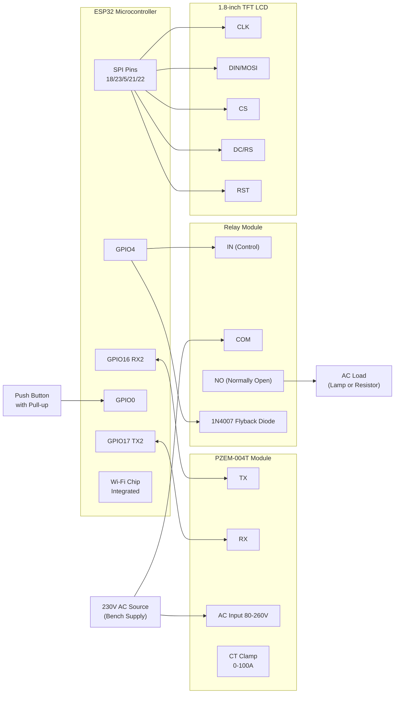

### 3.4.4 Power Supply Design

The system operates from a single 5V regulated DC power supply. The ESP32 module has an onboard 3.3V low-dropout regulator that powers its internal logic and the TFT display. The relay coil is driven directly from 5V via a GPIO-controlled transistor or through the relay module's built-in driver circuit, with the 1N4007 diode placed in parallel with the relay coil in reverse polarity to absorb the inductive kick-back when the relay deactivates.

The PZEM-004T module requires a separate 5V supply for its logic circuitry, with its measurement input directly connected to the AC mains line. During firmware validation, measurement data can be mocked in Wokwi or on a serial console, but the final current and energy behaviour is confirmed on the physical prototype with the actual module and test load.

---

## 3.5 Firmware Architecture

### 3.5.1 Layered Software Architecture

The firmware is organised into four abstraction layers following standard embedded software design principles:

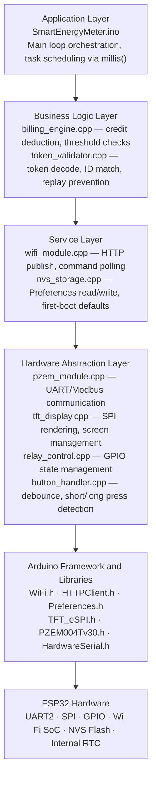

### 3.5.2 Module Descriptions and Interfaces

#### `pzem_module` — Energy Measurement Module

This module initialises UART2 at 9600 baud and sends Modbus RTU read-holding-registers requests to the PZEM-004T. It parses the 25-byte response frame and returns a `PZEMData` struct containing voltage, current, power, energy, frequency, and power factor values.

```
// Public Interface
PZEMData pzem_read();
bool     pzem_reset_energy();
```

The PZEM-004T communicates using Modbus RTU protocol. The request frame format is:

| Byte | Value | Description |
|---|---|---|
| 0 | 0xF8 | Slave address (broadcast) |
| 1 | 0x04 | Function code: Read Input Registers |
| 2 | 0x00 | Start register high byte |
| 3 | 0x00 | Start register low byte |
| 4 | 0x00 | Register count high byte |
| 5 | 0x0A | Register count: 10 registers |
| 6–7 | CRC | CRC16 Modbus checksum |

#### `billing_engine` — Prepaid Credit Deduction Engine

The billing engine is the financial core of the system. It computes the cost increment from the measured power and elapsed time, deducts it from the stored credit balance, and determines which output state to enforce (load connected, low-balance warning, or load disconnected).

```
// Public Interface
void    billing_init(float initial_balance, float tariff_rate);
void    billing_update(float power_watts, unsigned long delta_ms);
float   billing_get_balance();
bool    billing_is_low_balance();
bool    billing_is_credit_exhausted();
```

Credit deduction formula:

```
energy_increment_kWh = power_watts × delta_ms / 3,600,000,000
cost_increment       = energy_increment_kWh × TARIFF_RATE
credit_balance       = credit_balance − cost_increment
```

#### `token_validator` — Recharge Token Validator

This module validates a 20-digit numeric token entered by the user or received via IoT. It checks the meter ID prefix, extracts the credit value from the encoded digits, verifies the 4-digit checksum using CRC16, and confirms the token has not already been used by checking the token log in NVS.

```
// Public Interface
TokenResult token_validate(const char* token_string);
float       token_get_credit_value(const char* token_string);
```

The token validation sequence:

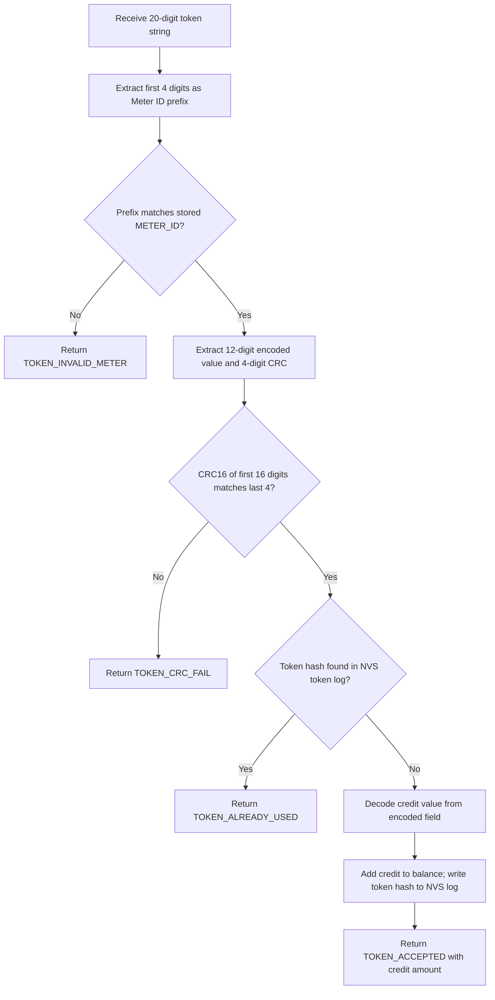

#### `relay_control` — Load Switching Module

Manages the state of GPIO4 to control the relay coil. Relay state is stored in NVS to enable correct restoration after power interruption.

```
// Public Interface
void relay_init();
void relay_on();
void relay_off();
bool relay_get_state();
```

#### `tft_display` — Consumer-Facing Display Module

Provides application-level screen rendering functions for the four screen states: Home Screen, Low-Balance Alert, Recharge Menu, and Status Screen.

```
// Public Interface
void display_init();
void display_home(float voltage, float current, float power, float balance);
void display_low_balance_warning(float balance);
void display_recharge_screen(int digit_position, char current_digit);
void display_recharge_result(TokenResult result, float credited_amount);
void display_status(bool relay_on, bool wifi_connected, String last_publish);
```

#### `button_handler` — Push Button Input Module

Implements software debouncing and distinguishes between short press (< 500 ms) and long press (≥ 500 ms) events for menu navigation.

```
// Public Interface
void button_init();
ButtonEvent button_get_event();  // Returns: NO_EVENT, SHORT_PRESS, LONG_PRESS
```

#### `wifi_module` — IoT Communication Module

Manages Wi-Fi connection using credentials stored in NVS, publishes telemetry to ThingSpeak via HTTP GET, and polls for pending remote recharge commands.

```
// Public Interface
void    wifi_init(const char* ssid, const char* password);
bool    wifi_is_connected();
void    wifi_publish_telemetry(PZEMData data, float balance, bool relay_state);
String  wifi_poll_remote_recharge();
```

#### `nvs_storage` — Non-Volatile Storage Module

Encapsulates all Preferences library read/write operations. Handles first-boot detection and default value initialisation.

```
// Public Interface
void  nvs_init();
float nvs_read_balance(float default_value);
void  nvs_write_balance(float balance);
float nvs_read_tariff(float default_value);
void  nvs_write_tariff(float tariff);
bool  nvs_read_relay_state(bool default_state);
void  nvs_write_relay_state(bool state);
bool  nvs_is_token_used(const char* token_hash);
void  nvs_log_token(const char* token_hash);
```

### 3.5.3 Main Firmware Loop Structure

The application layer coordinates all modules using non-blocking `millis()`-based time scheduling. This ensures that no single task blocks the others, which is critical for simultaneous display updates, UART polling, button scanning, and IoT publishing.

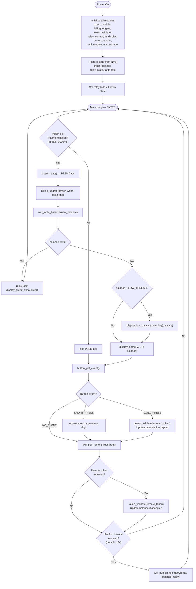

---

## 3.6 Energy Measurement Design

### 3.6.1 PZEM-004T Measurement Model

The PZEM-004T provides the following electrical parameters as pre-computed digital values delivered over UART Modbus RTU:

| Parameter | Range | Resolution | Register Address |
|---|---|---|---|
| Voltage (V RMS) | 80–260 V | 0.1 V | 0x0000 |
| Current (A RMS) | 0–100 A | 0.001 A | 0x0001–0x0002 |
| Active Power (W) | 0–23,000 W | 0.1 W | 0x0003–0x0004 |
| Energy (kWh) | 0–9,999.99 kWh | 1 Wh | 0x0005–0x0006 |
| Frequency (Hz) | 45–65 Hz | 0.1 Hz | 0x0007 |
| Power Factor | 0.00–1.00 | 0.01 | 0x0008 |

### 3.6.2 Energy Billing Calculation

Active power delivered to the load in AC circuits:

$$P_{active} = V_{RMS} \times I_{RMS} \times PF$$

Incremental energy consumed during a billing interval Δt (in milliseconds):

$$\Delta E_{kWh} = \frac{P_{active} \times \Delta t}{3{,}600{,}000{,}000}$$

Monetary cost of that energy increment at the configured tariff rate R (₦/kWh):

$$\Delta Cost = \Delta E_{kWh} \times R$$

Updated credit balance after deduction:

$$B_{n+1} = B_n - \Delta Cost$$

### 3.6.3 Billing Interval and Precision

The billing interval is set to 1000 ms (1 second) by default. At this interval and a typical residential load of 1000 W with a tariff rate of ₦68.00/kWh, the increment per second is:

$$\Delta Cost = \frac{1000 \times 1000}{3{,}600{,}000{,}000} \times 68 = ₦0.0000189/s$$

This is sufficiently fine-grained for accurate balance tracking and means a ₦1,000 credit would last approximately 14.6 hours at 1 kW load — consistent with real-world prepaid meter behaviour.

---

## 3.7 Prepaid Billing Engine Design

### 3.7.1 Credit State Machine

The billing engine operates as a three-state machine based on the current balance level:

```mermaid
stateDiagram-v2
    [*] --> CONNECTED : System startup with credit > LOW_THRESH
    CONNECTED --> LOW_BALANCE : balance < LOW_BALANCE_THRESH
    LOW_BALANCE --> CONNECTED : Token recharge restores balance > LOW_THRESH
    LOW_BALANCE --> DISCONNECTED : balance reaches 0
    CONNECTED --> DISCONNECTED : balance reaches 0 directly
    DISCONNECTED --> CONNECTED : Valid token recharge; relay_on()
```

| State | Relay | Display | IoT Alert |
|---|---|---|---|
| CONNECTED | ON | Home screen: V, I, P, Balance | Normal telemetry |
| LOW_BALANCE | ON | Low-balance warning + parameters | Low-balance alert published |
| DISCONNECTED | OFF | CREDIT EXHAUSTED screen | Disconnection event published |

### 3.7.2 NERC MYTO Tariff Configuration

The billing engine supports configurable tariff rates aligned with the NERC Multi-Year Tariff Order Band A–E structure. The tariff is stored in NVS and can be updated remotely via the IoT dashboard.

| NERC Band | Daily Supply Hours | Tariff Rate (₦/kWh) — Jan 2024 estimate |
|---|---|---|
| Band A | ≥ 20 hours | ≈ ₦206.80 |
| Band B | ≥ 16 hours | ≈ ₦68.00 |
| Band C | ≥ 12 hours | ≈ ₦50.00 |
| Band D | ≥ 8 hours | ≈ ₦43.00 |
| Band E | < 4 hours | ≈ ₦40.00 |

---

## 3.8 Token-Based Recharge Design

### 3.8.1 Token Structure

Each recharge token is a 20-digit numeric string structured as follows:

```
[4-digit Meter ID Prefix] [12-digit Encoded Credit Value] [4-digit CRC16 Checksum]
```

**Example token:** `1234 560000150000 7891`

- **Meter ID Prefix (digits 1–4):** Must match the meter's stored `METER_ID` constant to prevent cross-meter token use.
- **Encoded Credit Value (digits 5–16):** Encodes the credit amount in Nigerian Naira. In the simulation model, the credit value is stored directly in plaintext (digits 5–12 are the integer Naira amount, digits 13–16 are zero-padded).
- **CRC16 Checksum (digits 17–20):** A standard CRC16 computed over the first 16 digits, expressed as a 4-digit decimal. Used to detect manually forged or corrupted token strings.

### 3.8.2 Token Validation Algorithm

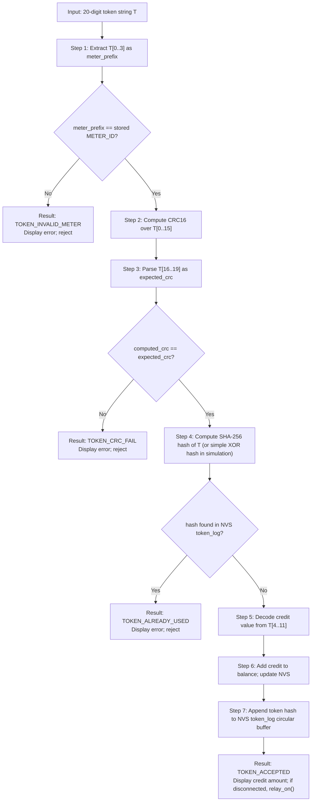

---

## 3.9 IoT Communication Design

### 3.9.1 Communication Architecture

The IoT communication follows a **Publish-Subscribe** pattern for telemetry and a **Request-Response** pattern for remote recharge commands. The ESP32 acts as an HTTP client that periodically pushes data to ThingSpeak and polls for incoming command fields.

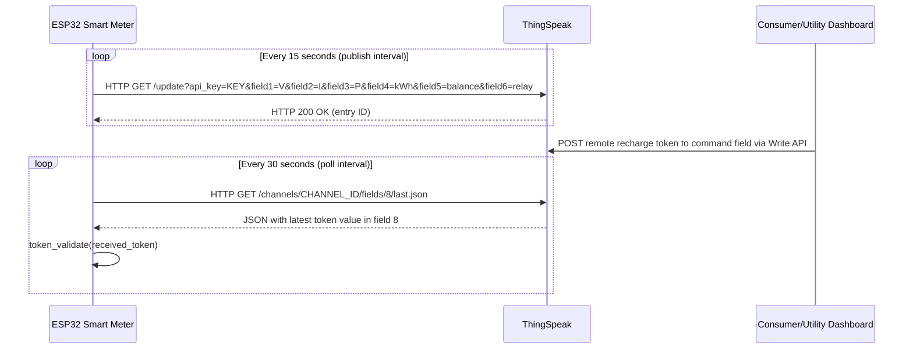

### 3.9.2 ThingSpeak Channel Field Mapping

| ThingSpeak Field | Variable | Unit | Description |
|---|---|---|---|
| field1 | voltage | V | RMS line voltage |
| field2 | current | A | RMS load current |
| field3 | power | W | Active power |
| field4 | energy_kwh | kWh | Cumulative energy |
| field5 | credit_balance | ₦ | Remaining prepaid credit |
| field6 | relay_state | 0 or 1 | 1 = connected, 0 = disconnected |
| field7 | power_factor | — | Power factor (0.00–1.00) |
| field8 | remote_token | string | Remote recharge token (written by utility) |

### 3.9.3 Wi-Fi State Management

The Wi-Fi module maintains connection status and handles reconnection gracefully. If the connection is lost during operation, the local billing and relay control logic continues uninterrupted. The module attempts reconnection at a configurable interval and resumes publishing when the link is restored. This design ensures that communication failure does not disrupt the core prepaid enforcement function [1].

---

## 3.10 Non-Volatile Storage Design

### 3.10.1 NVS Key-Value Map

The following variables are persisted in the ESP32 NVS using the Preferences library:

| NVS Key | Data Type | Default Value | Description |
|---|---|---|---|
| `credit_bal` | float | 2000.00 | Credit balance in Nigerian Naira |
| `cum_kwh` | float | 0.00 | Cumulative lifetime energy consumption |
| `relay_st` | uint8 | 1 | Relay state: 1 = ON, 0 = OFF |
| `tariff` | float | 68.00 | Active tariff rate in ₦/kWh |
| `meter_id` | uint32 | 1234 | Unique meter identifier |
| `tok_log_0` to `tok_log_9` | uint32 | 0 | Circular buffer of last 10 token hashes |
| `tok_idx` | uint8 | 0 | Write index for token log circular buffer |
| `first_boot` | uint8 | 0xFF | Sentinel value: 0xAA = initialised |
| `wifi_ssid` | string | "" | Configured Wi-Fi SSID |
| `wifi_pass` | string | "" | Configured Wi-Fi password |

### 3.10.2 First-Boot Initialisation

On first power-on, the `first_boot` key will not contain the sentinel value `0xAA`. The NVS module detects this, writes all default values to NVS, then sets `first_boot = 0xAA`. On all subsequent boots, the stored values are read directly without overwriting, ensuring credit balance and energy history survive power cycles.

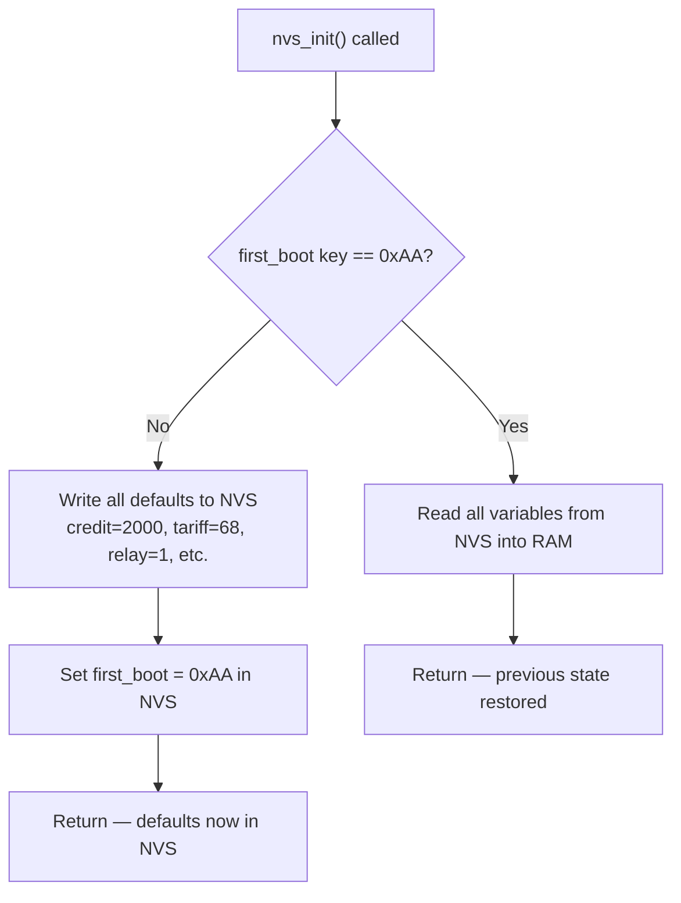

---

## 3.11 Display Interface Design

### 3.11.1 Screen States and Transitions

The TFT display cycles through four screen states driven by the meter's operational conditions:

```mermaid
stateDiagram-v2
    [*] --> HOME : Startup with credit
    HOME --> LOW_WARN : balance < LOW_BALANCE_THRESH
    LOW_WARN --> HOME : balance restored above threshold
    LOW_WARN --> CREDIT_EX : balance reaches zero
    HOME --> CREDIT_EX : balance reaches zero directly
    CREDIT_EX --> HOME : Token accepted; relay restored
    HOME --> RECHARGE : User presses button (short press)
    LOW_WARN --> RECHARGE : User presses button
    RECHARGE --> HOME : Token confirmed (long press)
    RECHARGE --> HOME : User cancels (timeout or re-press)
```

### 3.11.2 Home Screen Layout

```
┌───────────────────────┐
│  SMART PREPAID METER  │  ← Title bar (white text, blue bg)
├───────────────────────┤
│  Voltage:  230.1 V    │  ← Green text if normal, yellow if low
│  Current:   4.35 A    │
│  Power:   1000.5 W    │
│  PF:        0.99      │
├───────────────────────┤
│  Balance: ₦1,843.25   │  ← Green if OK, yellow if low, red if zero
├───────────────────────┤
│  Wi-Fi: ✓  Relay: ON  │  ← Status bar
└───────────────────────┘
```

---

## 3.12 Wokwi Firmware Validation Design

### 3.12.1 Validation Component Map

| Physical Component | Wokwi / Validation Equivalent | Configuration |
|---|---|---|
| ESP32 | Wokwi ESP32 DevKit | Load the Arduino sketch or compiled logic for firmware validation |
| PZEM-004T | Mock serial source or scripted UART input | Pre-loaded response frames for voltage, current, power, and energy values |
| 1.8-inch TFT LCD | ST7735 display model or serial output check | Confirm screen update logic and field formatting |
| 5V Relay | GPIO-controlled output / relay indicator | Verify load disconnect and restore logic |
| AC Load | Bench load or resistive test load | Used only during physical verification |
| 230V AC Source | Physical bench supply | Confirm final power-path behaviour on the prototype |
| Push Button | Wokwi push button | Used for menu navigation and recharge input checks |
| Wi-Fi (ESP32) | Serial monitor and live HTTP request check | Displays HTTP request strings and validation responses |

### 3.12.2 Validation Constraints

The following constraints apply to the firmware validation environment:

1. **Wi-Fi request logic** can be tested, but real network performance still depends on the final ESP32 hardware and the chosen IoT platform.

2. **PZEM-004T hardware behaviour** is not fully reproduced in Wokwi, so meter readings used during validation are mocked before final bench confirmation.

3. **AC mains behaviour** is not simulated in the browser environment, so load-side confirmation is completed on the physical prototype with a real test load.

4. **Thermal effects and line noise** are not reproduced in the validation environment, so final measurement confidence comes from bench testing and hardware observation.

### 3.12.3 Validation Setup Procedure

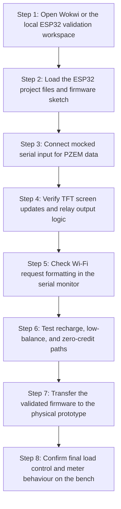

---

## 3.13 Test Plan

### 3.13.1 Test Strategy

Testing is conducted through Wokwi-based firmware validation and physical bench testing using black-box functional testing. Each test case defines a precondition, a set of input stimuli, an expected outcome, and a validation method. The test cases are mapped directly to the project objectives.

### 3.13.2 Test Cases

| Test ID | Objective | Precondition | Input Stimulus | Expected Outcome | Validation Method |
|---|---|---|---|---|---|
| TC-01 | NVS state restoration | Meter previously shut down with balance ₦1,500 | Power cycle (restart validation environment) | TFT LCD shows ₦1,500 on startup | Visual inspection of TFT display |
| TC-02 | PZEM-004T data acquisition | Validation environment running; mocked PZEM input active | Mock serial terminal outputs Modbus frame: 230V, 4.35A, 1000W | TFT home screen shows matching V, I, P values | Compare terminal output and display values |
| TC-03 | Credit deduction accuracy | Balance: ₦500; Tariff: ₦68/kWh; Power: 1000W | Allow the validation cycle to run for 60 seconds | Balance decreases by approx. ₦0.00113 per second | Monitor balance field over time with graph probe |
| TC-04 | Low-balance warning | Balance near LOW_BALANCE_THRESH | Allow billing to cross threshold | TFT shows low-balance warning screen; Wi-Fi terminal shows low-balance HTTP request | Visual inspection + terminal output |
| TC-05 | Zero-credit disconnection | Balance: ₦0.10; Power: 1000W | Allow billing to exhaust credit | Relay opens; TFT shows CREDIT EXHAUSTED; load lamp extinguishes | Relay state indicator + lamp component |
| TC-06 | Valid token via push button | Load disconnected; balance: ₦0 | Enter valid 20-digit token via push button menu | Balance increases by token value; relay closes; TFT shows success | TFT display + relay state |
| TC-07 | Invalid token rejection | Load connected | Enter token with wrong meter ID prefix | TFT displays TOKEN INVALID; balance unchanged | Visual inspection |
| TC-08 | Used token replay rejection | Valid token already applied | Re-enter same token | TFT displays TOKEN ALREADY USED; balance unchanged | Visual inspection + NVS log check |
| TC-09 | CRC failure rejection | Load connected | Enter token with last 4 digits modified | TFT displays TOKEN CRC ERROR; balance unchanged | Visual inspection |
| TC-10 | Remote recharge via IoT | Wi-Fi terminal active; load connected | Type valid token into Wi-Fi virtual terminal | Token validated; balance credited; relay state updated | Terminal output + TFT display |
| TC-11 | IoT telemetry publish | Wi-Fi terminal active | Wait for publish interval (15 seconds) | Wi-Fi terminal shows correctly formatted HTTP GET request with all field values | Terminal output inspection |
| TC-12 | Power-cycle relay restoration | Relay was OFF before shutdown | Restart validation environment | Relay remains OFF on startup; TFT shows CREDIT EXHAUSTED | Relay state indicator |

---

## 3.14 Summary

This chapter has presented the complete system design and methodology for the IoT-based Smart Prepaid Energy Meter. The iterative prototyping lifecycle with modular object-oriented firmware design was justified as the most appropriate methodology for embedded IoT development of this scope. The hardware architecture was described at component level including GPIO pin assignments and power supply design. The firmware architecture was presented as four layers — Hardware Abstraction, Service, Business Logic, and Application — each with clearly defined module interfaces. The energy measurement model, billing engine state machine, token validation algorithm, IoT communication design, NVS persistence strategy, and display interface were each fully specified with supporting diagrams and tables. The Wokwi validation workflow and functional test case plan were defined to provide a clear validation pathway for the implementation phase [1].

---

## References

[1] Gungor, V. C., Sahin, D., Kocak, T., Ergut, S., Buccella, C., Cecati, C., & Hancke, G. P. (2011). Smart grid technologies: Communication technologies and standards. *IEEE Transactions on Industrial Informatics*, 7(4), 529–539. https://ieeexplore.ieee.org/document/6011696
